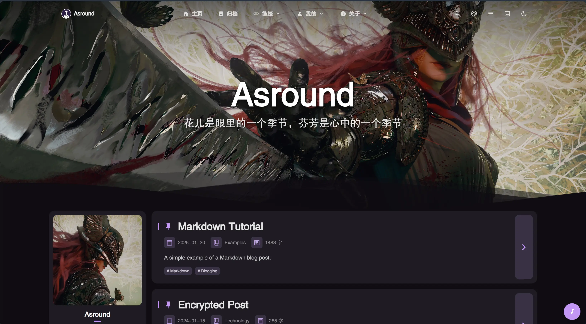

# Asround's Blog

A personal blog project based on [Mizuki](https://github.com/matsuzaka-yuki/mizuki)  template, using Tencent Cloud EdgeOne Pages service to build a website Can be accessed through domain name

## 📄 License

This project is licensed under the Apache License 2.0 - see the [LICENSE](LICENSE) file for details.

### Original Project License

This project is based on the [Mizuki](https://github.com/matsuzaka-yuki/mizuki) template, developed on [Fuwari](https://github.com/saicaca/fuwari), and licensed under the MIT license. According to the MIT License requirements, the original copyright statement and license statement are included in the LICENSE.MIT file

## 🙏 Acknowledgements

- Based on the original [Mizuki](https://github.com/matsuzaka-yuki/mizuki) template
