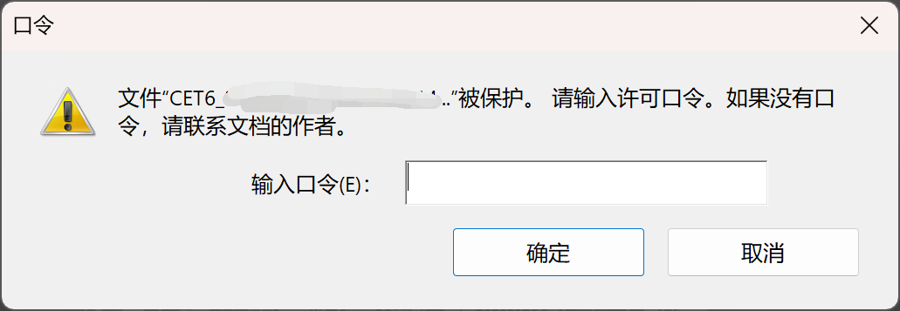
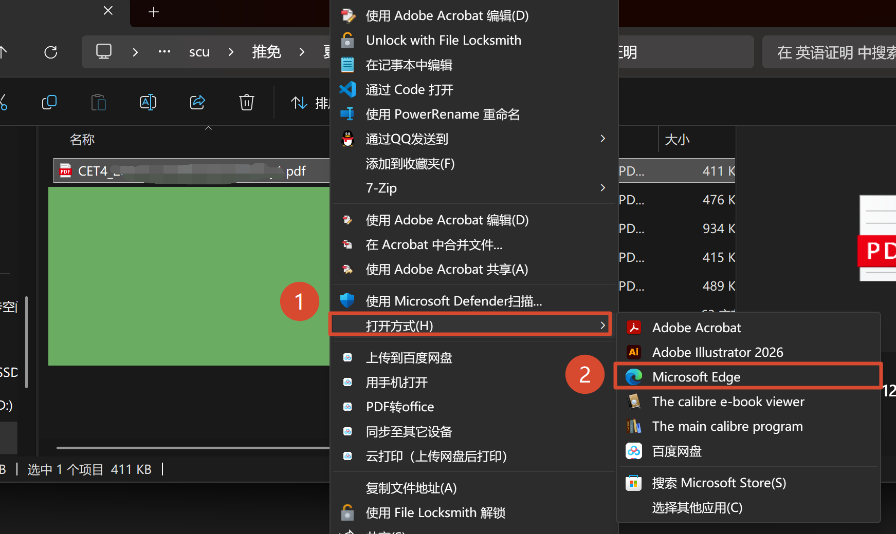
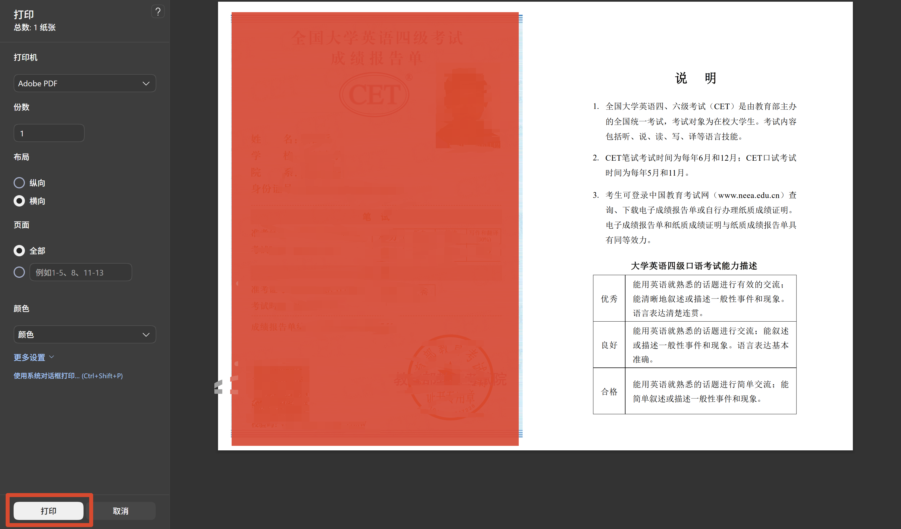

# "PDF文件被口令保护无法合并"解决办法

> 参考文章链接: [“Adobe文件被保护，请输入许可口令”如何破解—适用于可以打印的文档（但不需要用打印机）_文件被保护请输入许可口令-CSDN博客](https://blog.csdn.net/weixin_43568722/article/details/119834311)

## 背景

笔者在准备夏令营和预推免的时候, 由于不少学校要求多个证明材料合并为一个PDF上传, 故有将四六级成绩PDF(在官方下载的源文件)与其他文件合并的需求. 但是, 在使用 Acrobat 的文件合并功能时, 弹窗显示有口令, 不能合并:

这么做的原因其实很简单, 四六级这种官方文件, 是有加密的, 各种文件操作都受限(修改内容更是被禁止的).

但是这无疑对合规的材料打包造成了麻烦. 笔者在网上搜索到了一篇[文章](https://blog.csdn.net/weixin_43568722/article/details/119834311), 其给出了一个不错的解决办法, 故将其记录于此. (原文遵循**CC BY-SA 4.0**协议, 原链接在文章开头)

## 操作方法

1. 将文件在 Edge 浏览器中打开:
   

2. 在浏览器中打开后, 使用快捷键: Ctrl + P, 唤出打印界面:
   
   > 打印机选择"另存为PDF"也可以, 笔者常用 Acrobat, 这里保持默认.

3. 然后使用打印出的文件来合并, 即不会显示有口令限制了.

## 其他说明

1. 为什么不直接截图?
   1. 实际上是可以的, 没有问题, 甚至笔者认为直接打印+扫描也行. 因为本质上是扫描二维码查成绩, 只要保证二维码清晰可扫出即可.
   2. 只能说是个人喜好, 更偏向于有矢量性质的PDF.
2. 其实直接用 Acrobat 的打印也可以, 效果是一样的. 只是考虑到可能读者的电脑上只有 Edge 浏览器, 故采用 Edge 作为教程媒介.
3. 该方法同样适用于我校的成绩单文件. 但注意, 成绩单文件是不一样的问题:
   1. 成绩单可以直接合并: 但是会缺失教务处的盖章(在每页的中下部), 这是 Acrobat 添加的签章, 直接合并时无法保存.
   2. 经过上述打印+合并后: 可以保留盖章.
   3. 但笔者也是成文时才想到这个问题, 此前采用的方法是, 打印成绩单, 并使用设备扫描, 然后合并上交.(这个方法没有任何学校有问题, 至少没有因为这个而让笔者没进面试)
4. 有些 PDF 是不允许打印的. 添加口令限制时可以选择限制范围, 如果文档制作者限制了打印权限, 那这种方法是无效的.
