# 夏令营与预推免感想

## 总结

本人情况如下: (注: 能报集成电路都报的是集成电路, 能报数字/设计的都报数字/设计, 有学硕的只报学硕)

1. 入营
   1. 北深夏令营: 入营, 无考核
   2. 交大夏令营: 学硕入营, 高位优营, 排名20左右. 笔试90+, 面试85+
      1. 通知流程个人认为最好的学校, 十分放心, 且老师不催促. 但填系统的时候没打通老师电话, 故还是接受了面试通知, 但后续打电话问我复试时, 我直接就拒了.
   3. 东南预推免: 设计学硕入营, 优营, 排名20左右
      1. 老师比较催, 发 qq 一直在问, 后面拿到北深 offer 后马上就线上拒了, 也不想拖着候补的同学.
      2. 其他入营没去的都是很快拒了.
   4. 南大预推免: 入营, 没去. 没去的都在规定时间内尽早拒绝了, 没有故意拖.
   5. 复旦预推免: 入营, 没去(读不起 QAQ )
   6. 北深夏令营: 入营, 优营, 最终去向
   7. 浙大超大所预推免: 候补入营(电话通知), 没去
      1. 刚好是北深面完打来的, 要求第二天就去.
      2. 然后有意思的是, 我校 rk2 在我拒后也马上接到电话了(
2. 未入营
   1. 北集夏令营, 北深夏令营(未过论文筛)
   2. 国科大线上营: 第一志愿 AI 中心, 不知道为什么没进.(因为比我 rk 低的同学进了)
   3. 电科预推免: 没联系老师没加群, 自然不会让我进
   4. 清华预推免: 集工集管. (没报先进制造, 同校稍低 rk 的同学报先进制造进了)

后续按照顺序整理一下自己的经历, 内容有文学加工, 图是 AI 画的, 题目是自己编的, 读者看个乐就好.

## 第一站: 北京大学-信息与工程学院 交流探索营

北上广深, 这次来北深[doge]:

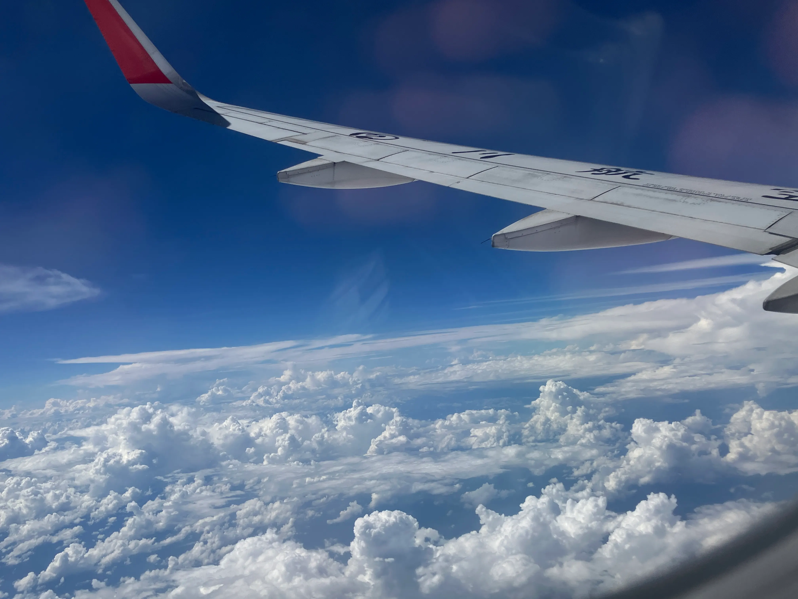

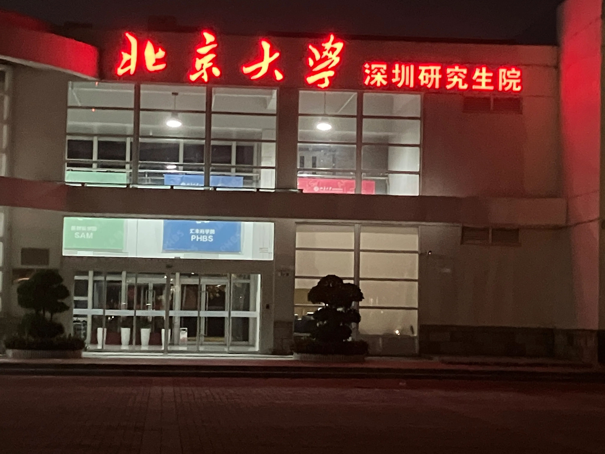

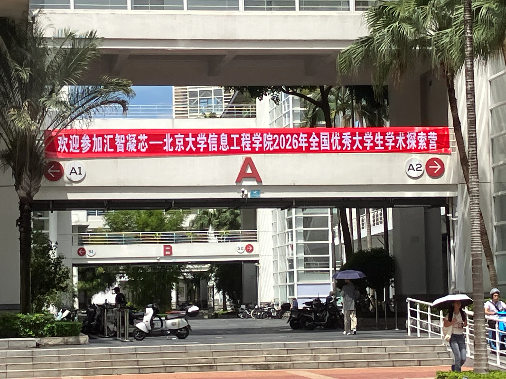

### 活动安排和内容

探索营时间: 7 月 10 日至 7 月 12 日

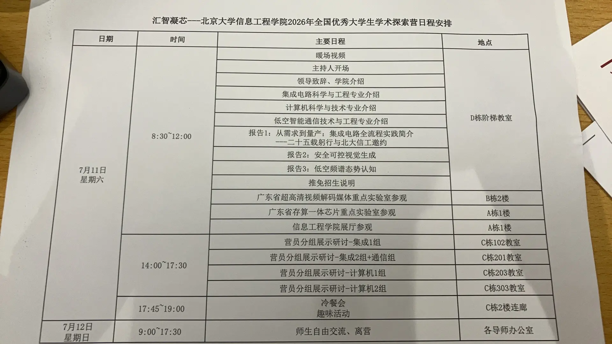

#### 第一天(7 月 10 日): 下午报道, 在深研院 A 栋(信院楼)一楼处签字报道, 领取营服, 探索营介绍卡和安排表等.

> 最后一张图的红色小本本和充电宝是我参加活动赢的 ~

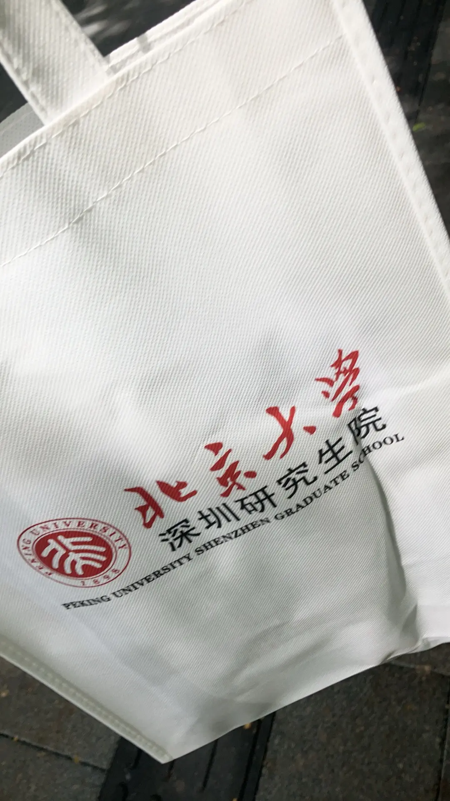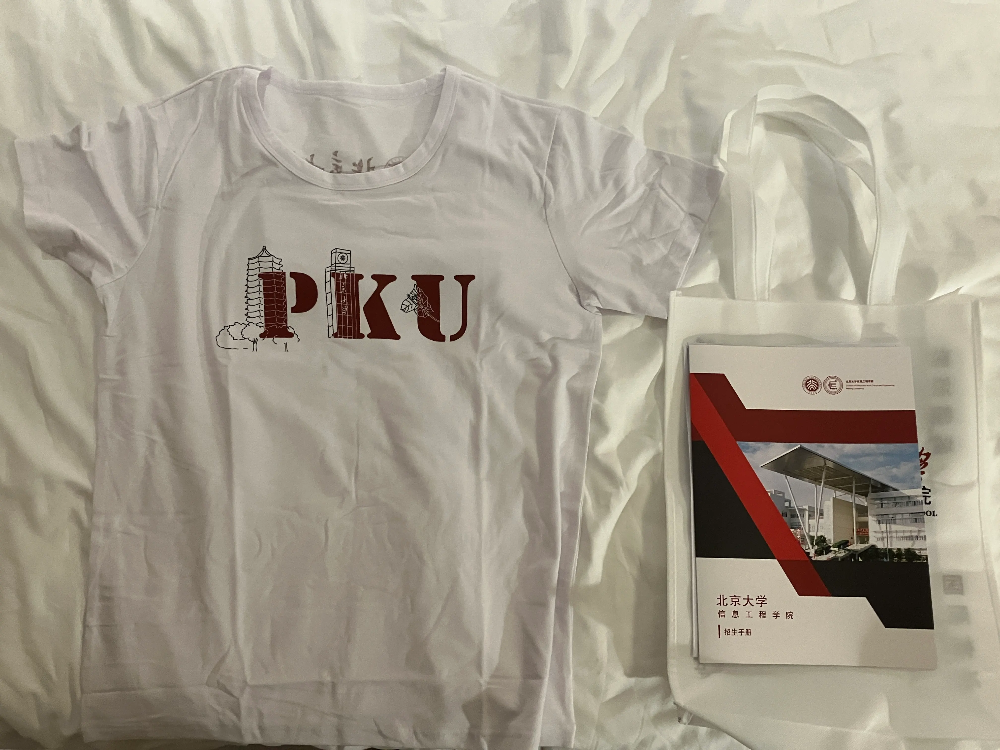

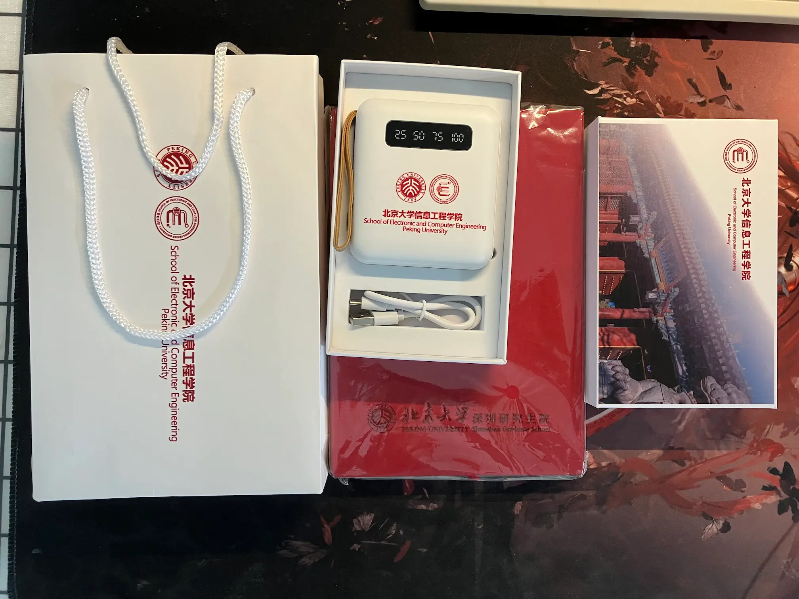

#### 第二天(7 月 11 日): 一天活动

- 上午:

  - 听讲座

    1. 信院介绍, 建院历史等

    2. 各个专业介绍

       - 今年特色就是通信方向的招生专业为低空通信(全称是啥来着...)

    3. 推免流程和注意事项介绍

       - > 不知道是否可以直接分享, 建议有兴趣的读者与笔者联系, 可以提供一些信息

  - 参观

    - 参观了信院楼, 各个实验室, 第一次见到全身防护服(读者请立马回顾 IC 工艺课, 具体应该叫啥)工作的人员, 以及其他高级设备

  - 体验食堂

    - 发了 100 块的餐券, 看起来食堂里面还是有不少好吃的. 有个排骨饭很想吃, 但人太多了, 遂吃旁边的面了. 
      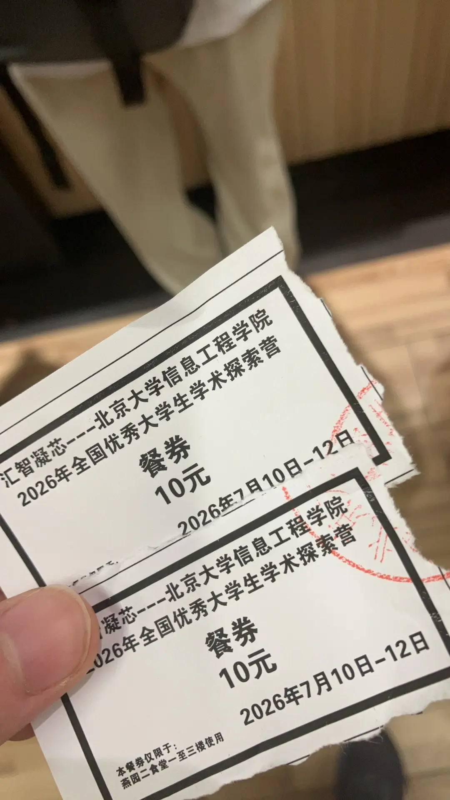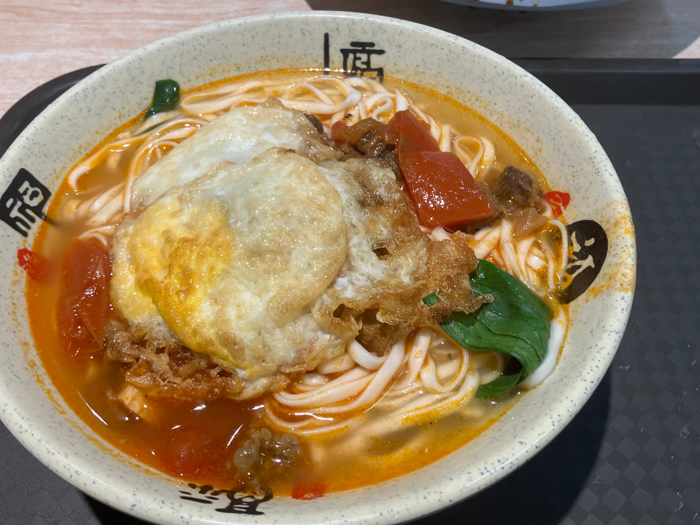
    - 价格稍贵, 比本校还是明显价格高一点的

- 下午:

  - 交流活动: 营员分专业分组, 在不同教室进行活动

    1. 每个人 2-3 min 自我介绍

       - 这听起来没什么是吧, NO, 这个环节 Absolutely insane...
         - 有六级 660 分的真人大佬
         - 有物理竞赛全省第一全国金牌的
         - 甚至还有已经流片的, 并且下一个流片项目也即将流片的了...
       - 总归是长见识的, 一个教室基本都是全国各地学校的 rk1, rk2, 各有各的优秀和精彩

    2. 分组抽题回答问题: 问题相对都比较大, 而且贴近新兴的内容

       - 将问题记录于此:(提醒: 这不是面试问题, 本次"探索营"没有较为严肃的面试环节)

         1. 开源芯片(如 RISC-V)是否会成为未来 IC 发展的绝对主流
         2. 说说你对华为"稻定律"的理解
         3. "摩尔定律"放缓, 后摩尔时代的 IC 新人该"卷"向何方?
         4. AI 会取代 IC 设计工程师吗?
         5. (一共 5 题, 但是仅有四组, 所以并不知道剩下一题为何)

       - 回答问题表现好的(语言表达)还有奖励呢, 成功拿下一个北深信工官方充电宝:

         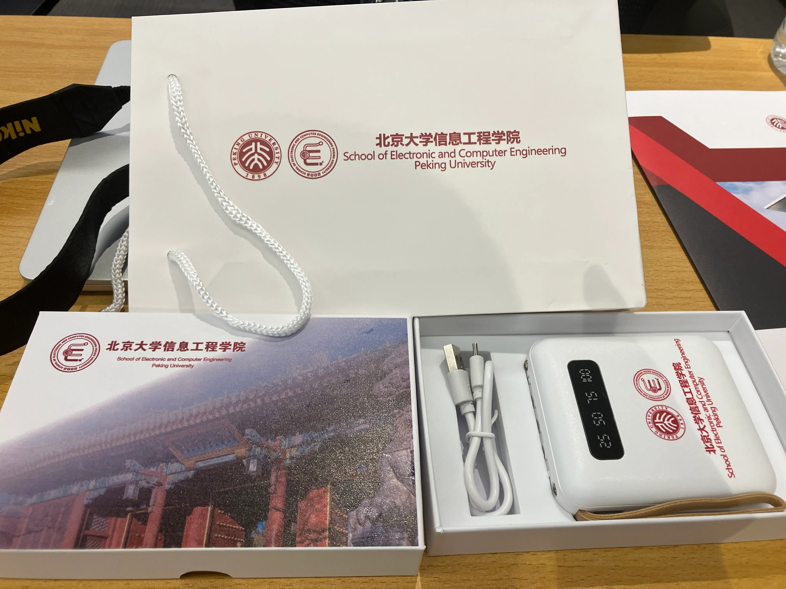

    3. 冷餐会: 有些甜点小吃, 整挺好, 就是在外面有点闷, 这不好. 顺带一提, 小甜点也还挺好吃.

       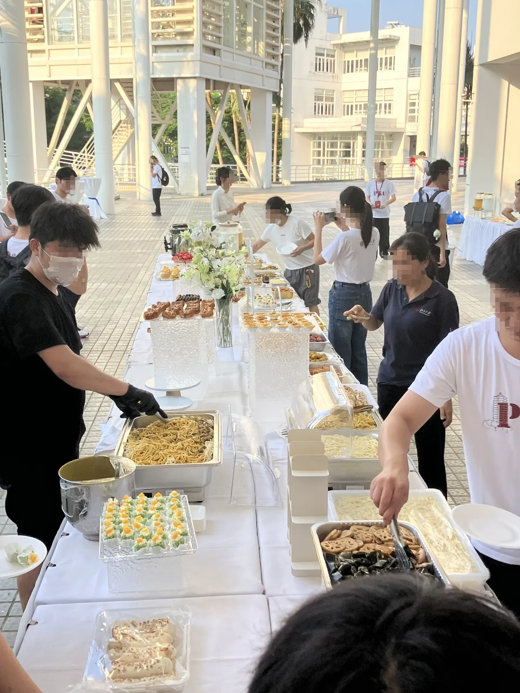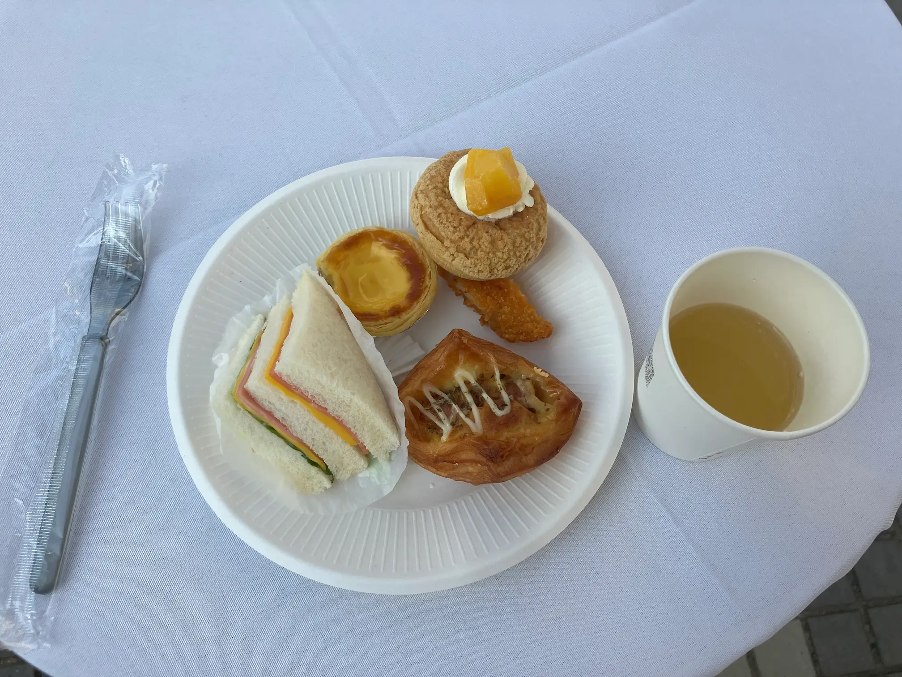

    4. 娱乐活动: 做游戏, EMOJI 猜成语和专业相关名词, 数字炸弹, K 歌之王...

       - 这个环节在后面坐着和大佬们聊天去了, 没怎么参加. 领了一个官方周边小帆布袋, 就跑路了

#### 第三天

这一天是无任何官方安排的活动的, 为开放交流日, (参与招生的)老师在办公室, 鼓励学生直接上门进行交流.

值得一提的是, 本次活动是"探索营", 以纯交流为主, 并不是含有严肃面试的"夏令营", 所以是不发 offer 的, 笔者找的老师也并没有进行太深入的能力探讨.

由于时间关系, 和老师在办公室的时间关系, 笔者只有幸与两位老师进行了交流, 一是崔小乐教授, 一是苏钰淇助理教授. 均是和数字前端能比较相关的老师, 还有一些老师虽然有兴趣, 但是要么不在要么时间太紧, 就没有单独拜访了, 也是略显遗憾.

> 交流具体内容本文便不详述了, 内容较多较繁, 且笔者也难说自己了解的比较清楚(特别是老师的具体研究方向, 以及学界和业界的趋势), 所以不斗胆去描述了, 更多的是体验的记录. 如果读者有兴趣, 也可以和我进一步联系交流.

##### 与崔小乐老师交流

与崔老师交流是十分放松的, 有些时候老师讲着讲着把自己都逗笑了, 并且笔者认为崔老师之言极为实诚. 

崔老师首先自己介绍了自己实验室的研究方向与研究课题, 明确告诉了我们(对, 我是半途加入的, 后面快聊完了还加了一个, 最后仨人坐沙发上)实验室的特色和主攻方向, 能提供的方向, 以及不会涉及的方向. 同时还穿插着简单提到了老师自己做的国家自然基金以及其他项目. 值得注意的是, 该环节持续了将近 30 分钟...(或许是最早来, 老师还精力十分充沛的缘故罢)

然后就开始重复: 崔老师询问我们: 你们还有什么问题? --- 我们思考, 并提出问题 --- 崔老师回答 --- 崔老师继续询问: 你们还有什么问题? --- ...

总体来说我们提的问题方面还是挺多的, 有直接询问老师近期论文内容的(我前面那位甚至拿笔记本做了笔记, 直接给老师看的, 态度十分认真), 有询问老师研究方向发展情况的, 有询问老师招生情况的, 有问老师需要会啥东西的... 总之还是问了不少问题, 这部分时间又占了 30 多分钟, 后面实在是现场想不到问题了, 我和那位最先进去的同学就先行告退了, 留了最后进来那位同学给老师递简历继续聊.

聊完出来一看时间都 11 点过了, 笔者又和那位最先进办公室的大佬聊了一会, 收获颇丰.

##### 与苏钰淇老师交流

敲门时已经是 11 点 20 多了, 事实证明这是个不好的时间点, 因为聊完苏老师就和其他老师吃饭去了, 让老师饿着肚子和我聊说是...

苏老师比较实在, 直接对着笔者的简历进行了一番(不太深入的)询问, 主要涉及了课程, 前后端经验和项目经历的浅表内容. 同时对笔者学校没有开设数集的课程感到十分惊讶...(我也很惊讶)同时还问了一下为什么是物理学院...(当年我报名的时候也觉得挺奇怪的...)

苏老师明确表示今年不发 offer, 都不知道应该怎么和学生聊, 这是相当可以理解的. 之前夏令营肯定主要以能力考核为主, 但交流营显然不应该如此, 所以反而是老师介绍自己做的内容偏多. 我也简单去了解了一下苏老师的方向, 感觉下来苏老师对学生的要求是比较高的, 并且苏老师自己有十分明确的路径规划和想法, 而且对能做全流程的全栈学生比较青睐.

我个人觉得苏老师的培养模式和他对自己课题的清晰程度, 是十分不错的, 其聊天中也凸出一种"高效感". 并且苏老师不论是对研究还是经费, 都有相当的自信, 我猜这可能也是有许多学生申请远程科研的原因吧.(今年已经有一个苏老师远程指导的学生有流片级别的项目产出了, 实在是优秀)

### 与其他营员(大佬)的交谈

> 一定是要相信人外有人的. 你怎么就知道坐你旁边的不是一个本科流片的大佬呢?

11 日午餐过后, 走进分组安排的教室, 便有两位同学在交流入营和老师的相关内容, 同时谈到了一些比赛和论文的东西, 笔者也顺势插话参与了进去. 果不其然两位都是各自学校 rk1 的佬, 而且都和笔者一样没联系到老师居然也进了. 后续也是针对各种话题闲聊了很久, 了解了不同方向同学的经历啥的, 总之挺有意思.

第二天也和其中一位同学交流了和老师交谈的感受, 以及对自己以后的规划什么的. 中途也遇到其他来寻找

作为第一个参加的夏令营, 虽然没有面试, 但体验其实还是不错的, 也许, 还会回来的吧?

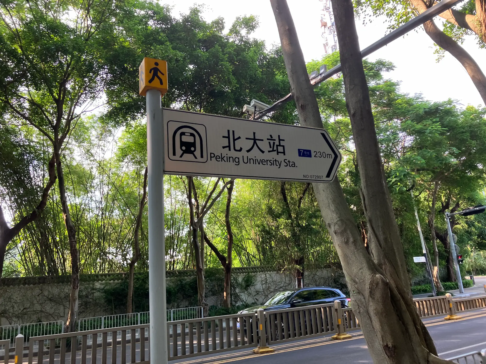

---

## 第二站: 上海交通大学-集成电路学院夏令营

上海, 其实我对这个城市挺有滤镜的, 也是第一次来:

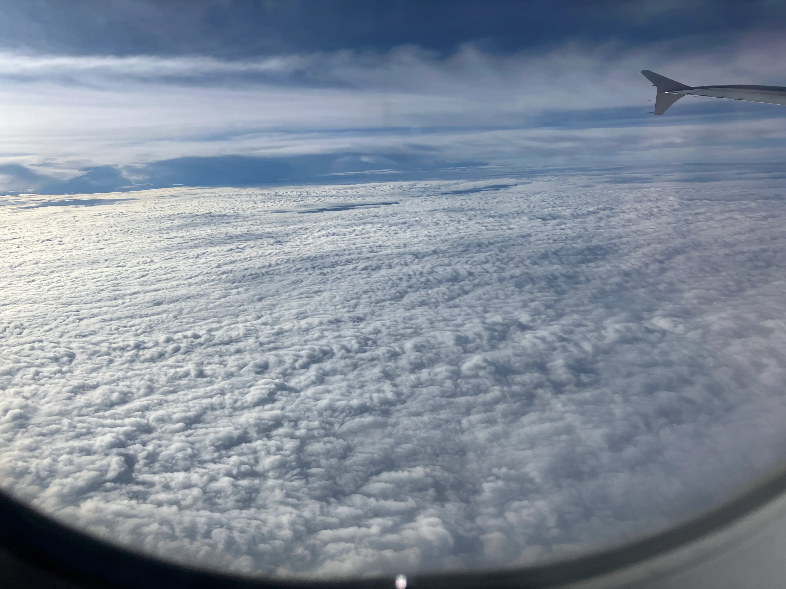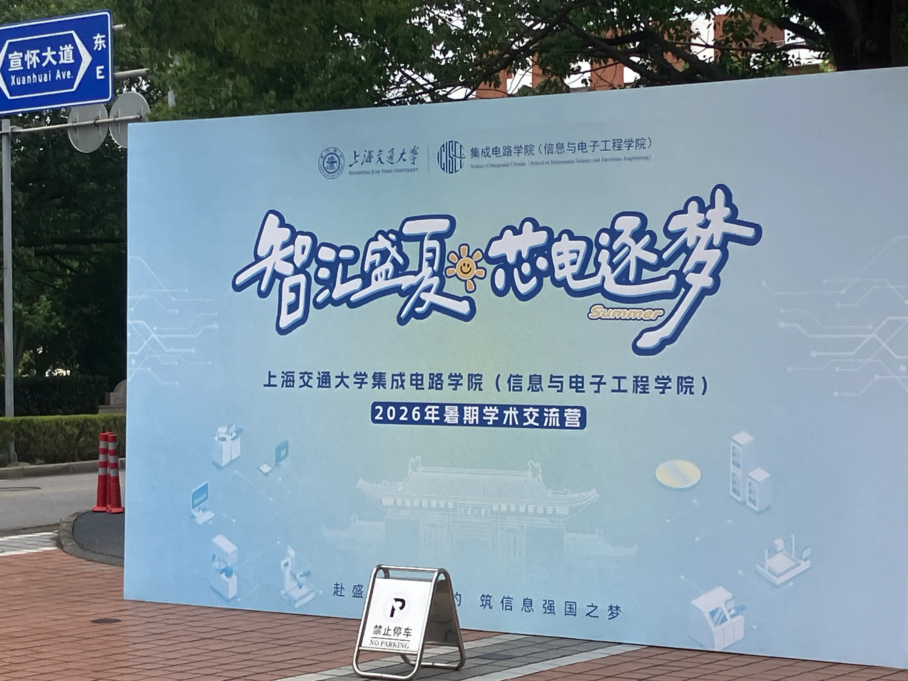

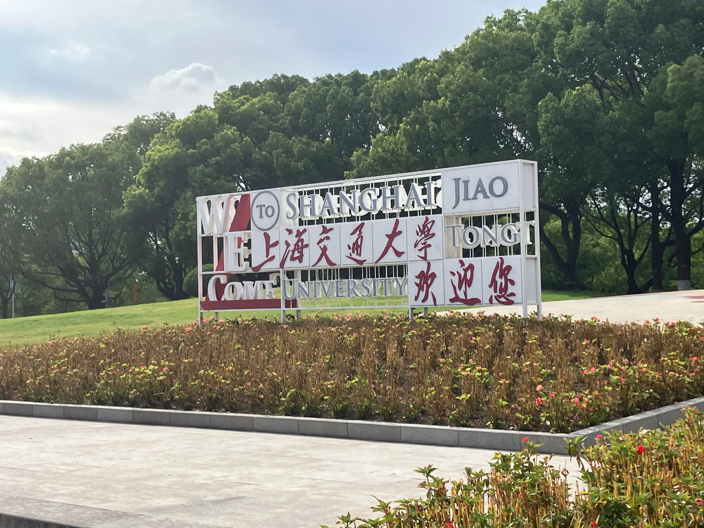

### 活动安排和内容

探索营时间: 7 月 28 日至 7 月 29 日

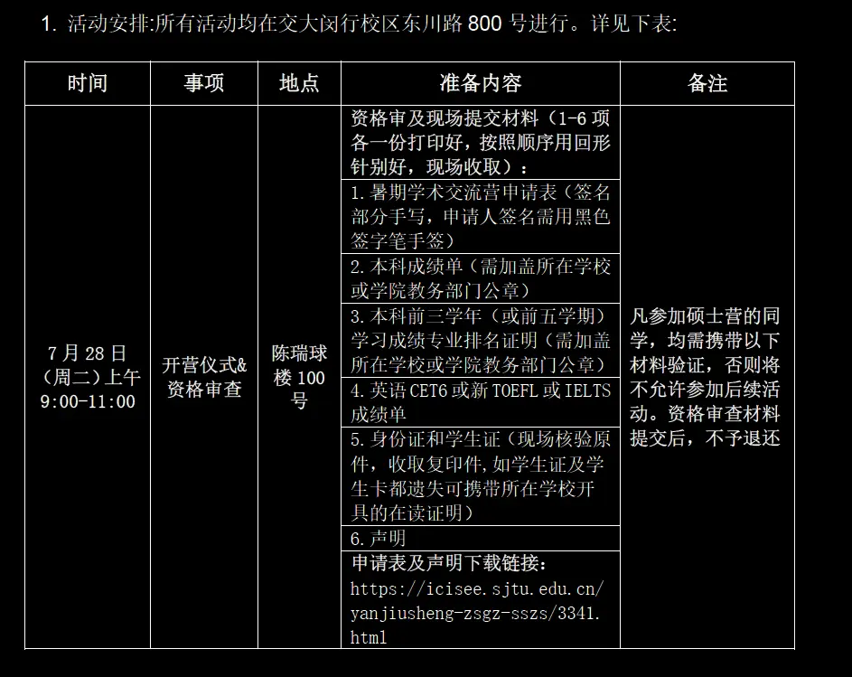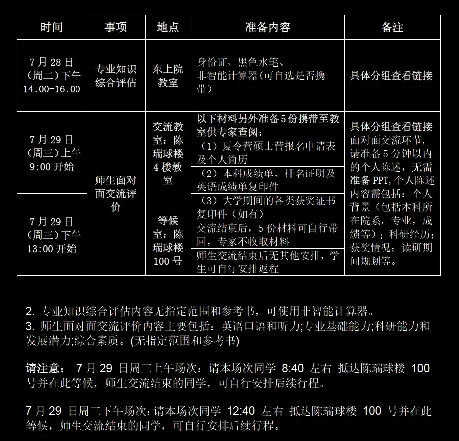

#### 第一天(7 月 28 日): 上午报道开营, 在陈瑞球楼(研究生楼?)报告厅开营, 宣讲结束后进行资格审查(收取文件并签到)

我以为只签到呢, 9 点还在酒店慢悠悠准备走, 结果 9 点开始宣讲... 高达两公里的距离不得不打车了... 宣讲部分也就听了十几二十分钟, 没听到什么特别有用的信息.

然后是 800 个人的大海营排队签到, 等了将近一个小时. 送了个 20 块餐券(傲娇这一块, 明明说学生自理食宿交通的, [doge]), 然后是传统帆布袋, 礼品小风扇, 遮阳帽, 以及一个很有创意的段落轴挂饰小键盘.

> 帆布袋忘了拍了, AI 也不给我生成, 太坏了

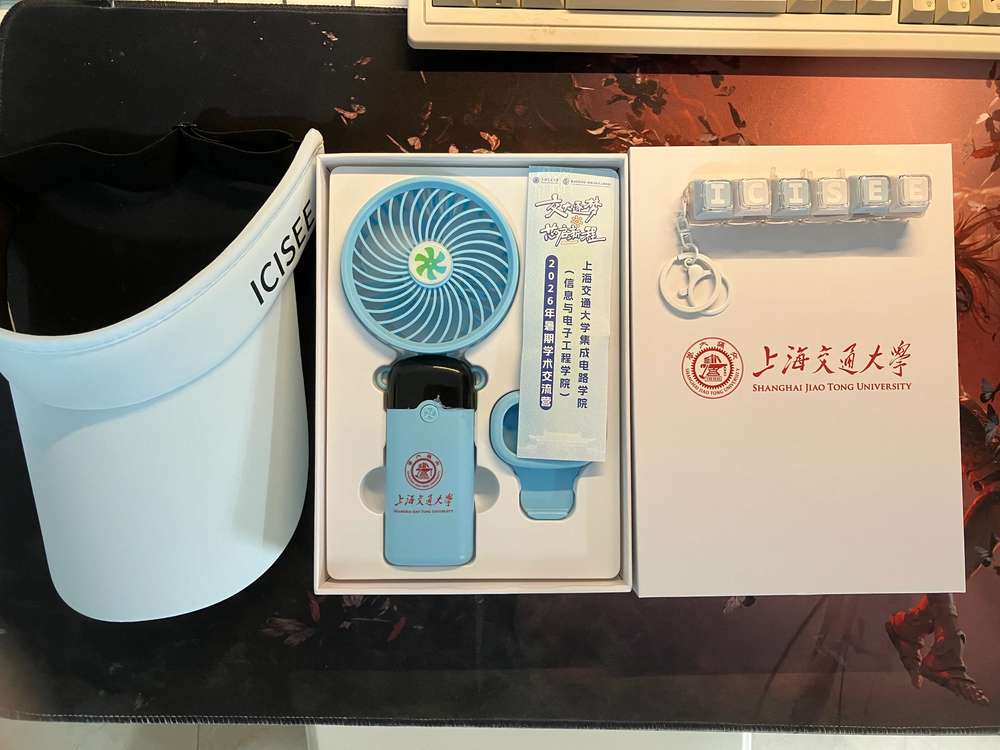

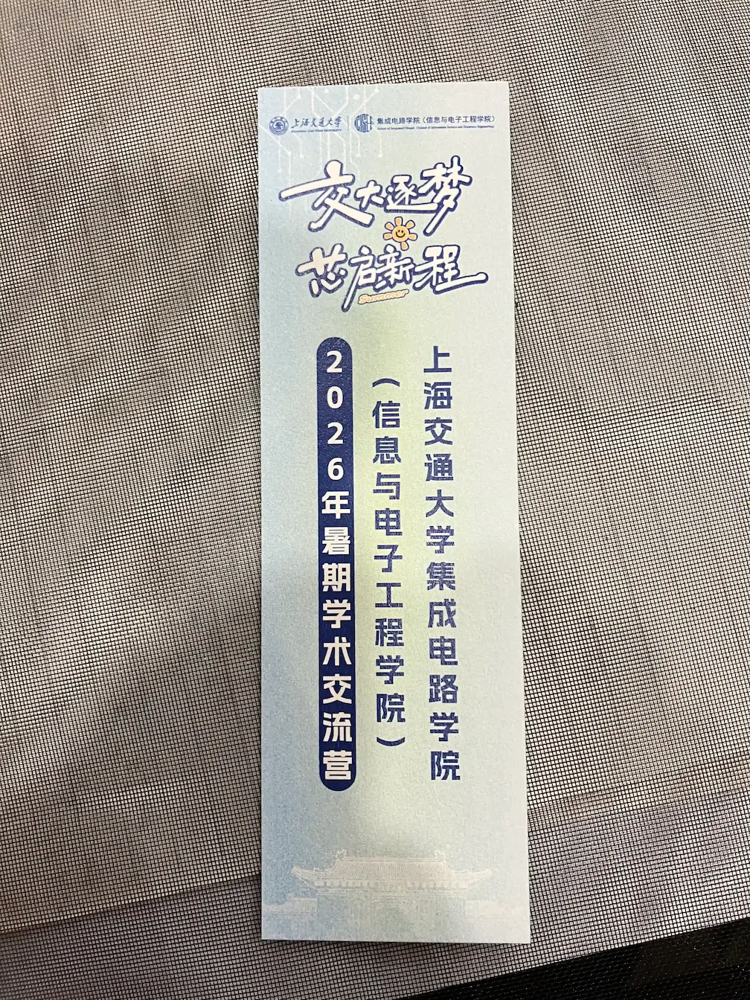

---

#### 第二天(7 月 29 日): 分组面试

分为上午 9 点开始和下午 1 点开始的两场分组面试. 我个人在下午场. 值得一提的是很多本校同学也在下午场, 并且序号很靠前.

笔者是面试序号第 4, 也是比较早面试的了. 以下大致介绍一下我经历的流程:

1. 进门交身份证核验, 以及给各位老师准备的多份文件(简历, 申请表, 各种证明材料)

2. (没明说时间要求的)中文自我介绍: 现场是根据我自己提前准备的 5min-7min 版本来的, 没有老师叫停

3. 提问环节, 大致如下:

   1. 首先是竞赛相关, 老师可能也是方向比较对应, 问了一些概念性问题以及工业界的选择, 让我做分析.
      - 可能是答得并非很好, 老师还给我建议, 可以去看看某公司的某个产品是如何设计的
   2. 然后主要就是项目相关, 几个老师针对不同项目问了很多问题, 但可能老师对我的方向不是特别熟悉, 没有问到关键的技术细节. 很大程度上是让我解释为什么要这样做, 有什么好处, 相对于传统做法有什么差别.
   3. 最后有一个老师询问未来规划, 说我写的有点模糊, 问我如果导师方向和兴趣方向不一致我会怎么办.

   - (提问环节响铃, 应该是预示时间该到英语环节了)

4. 英语提问, 只有一个问题:

   1. 你参与撰写了一篇论文, 你能否进行简单的介绍, 比如核心创新点, 意义, 实践价值等?

   - 其实没太严肃准备这个问题, 现场发挥的, 讲了 2 分钟左右.

5. 一些可能有用的普适问题: (其他都是项目强相关, 对读者应该无甚价值)

   1. 流水线是什么, 有什么意义?
   2. 分析一下, 如果一个芯片有 30 级流水线.
   3. 太空中的辐照来源.

(根据我的经历)总结来看:

1. 英文环节不多, 而且侧重不考察专业词汇, 更多应该是表达和流畅度.
2. 问题一点都没提专业课的, 至少没有直接提, 间接的也基本没有.
3. 问题更加集中于项目, 而非比赛.(这可能跟老师方向有关)
4. 具体问题有一些做了追问, 有一些只是简单询问并让我解释.
   - 还有老师没看懂的, 让我解释的, 可能确实方向不同
5. 不怎么压力, 老师比较友好, 就是单纯的提问回答的氛围

---

## 第三站: 东南大学-集成电路学院预推免 感想

算上之前嵌赛决赛的话, 这是第二次来南京了:

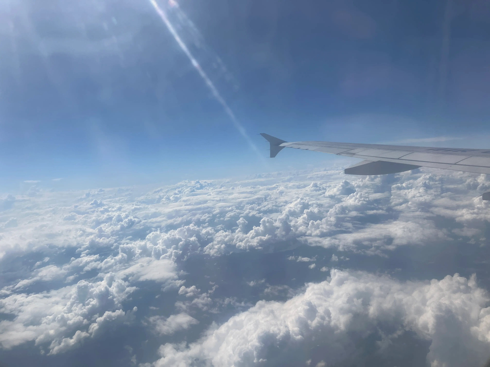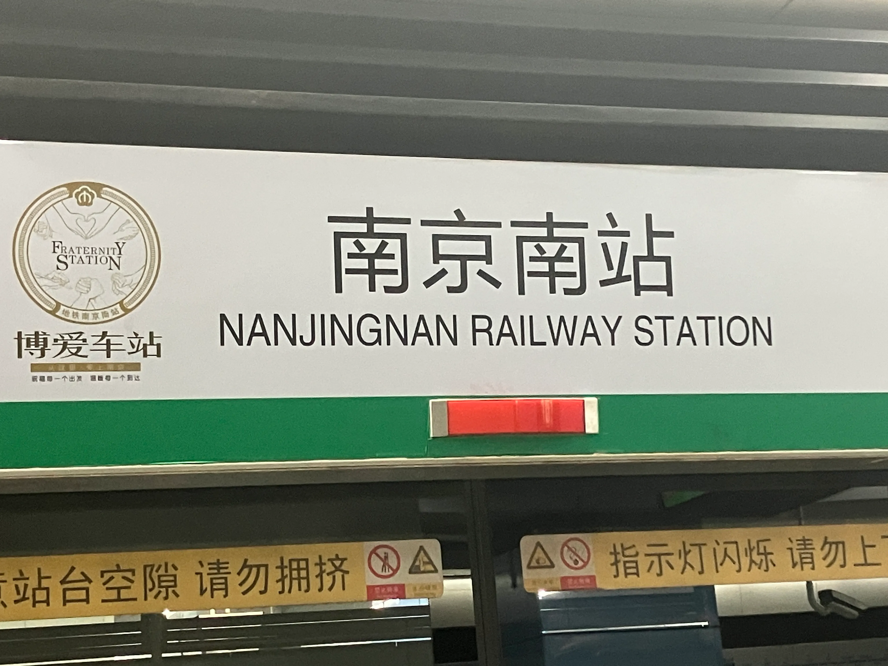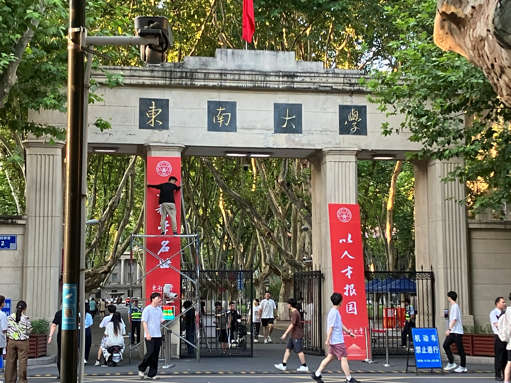

### 活动安排和内容

> 第一天参观, 第二天面试

但是笔者第一天没有去参观, 因为参观地点在江北, 离学校距离有些远, 感觉也没什么太大意思(又不能和老师交流), 故而只参加了第二天的面试.

---

### 第二天和面试

笔者的面试排位十分靠后, 要排到下午, 但也不想留在酒店, 顺便想蹭一下东南的餐厅(会发餐券), 便早早退房去了候场教室.

入校走的南门, 门面还是十分好看的, 不过右转的中山院内里便显得有些老旧了, 颇有些老家安置房的感觉. 现在想来可能是灯光和墙面的缘故, 显得有些阴暗.

上午一到教室便看到本校另一位同学也在, 她是上午面试. 简单交流后便各自复习, 等到中午便去南门外的学习食堂吃了午饭, 实在也没看到什么特色, 就点了个馄饨和炸鸡腿, 各是 10 块, 光盘了, 吃挺饱.

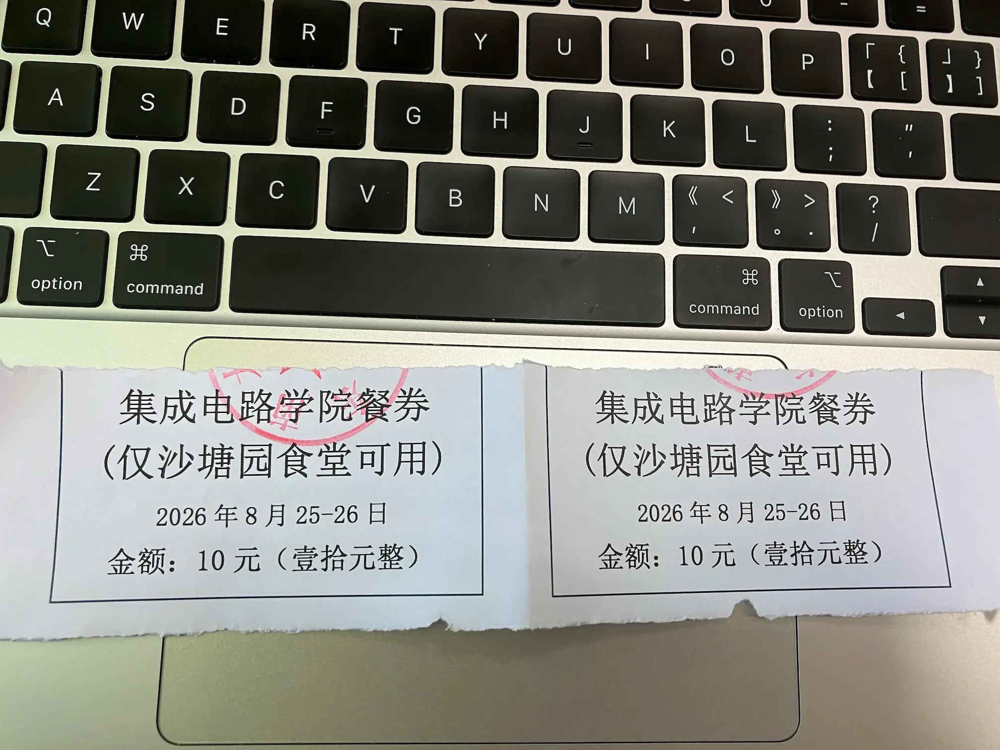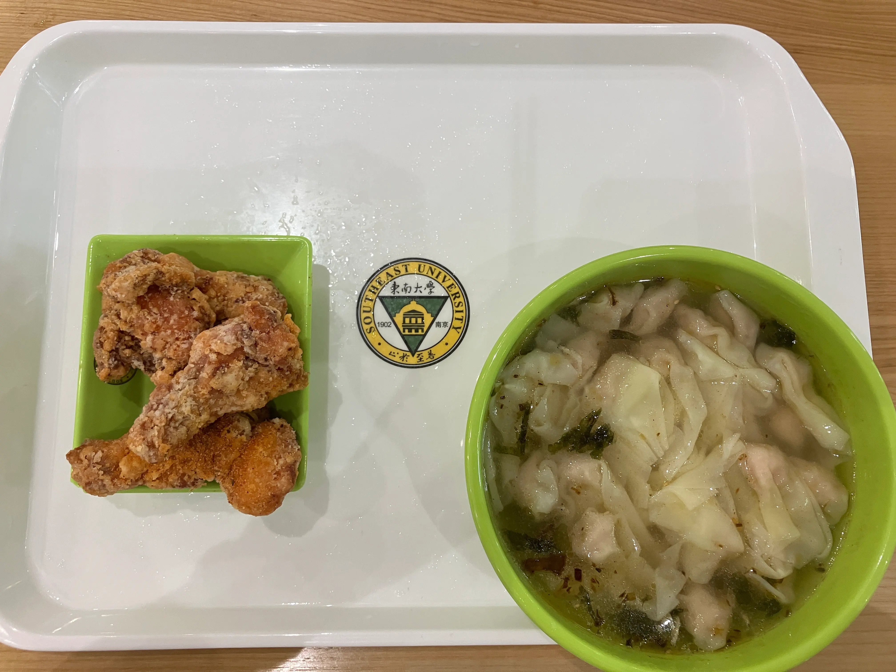

下午复习一阵后, 教室外又进来一个之前北深加过好友的同学, 给我打招呼时才抬头发现其已到我旁边. 复习之余也交流了一下之前上交的情况和目前的想法和安排, 总结下来四个字: 接受现状.

终于轮到面试. 在教室外面等了前一位面试结束, 进去后先是 5 分钟自我介绍, 然后是老师英语提问: 选择一个你的项目, 说一下你在其中收获了什么. 接下来是中文的提问, 感觉老师不太了解我做的这些项目, 问题大都不太严格, 一些(对于读者可能有意义)问题大致如下: (并非实际面试顺序)

1. 介绍一下数字集成电路全流程
2. 介绍第一个时, 打断并询问了特定流程环节中, 使用了什么 EDA 工具
3. 数字集成电路环节中, 还有时钟树综合, 这个是干什么的?
4. 论文方面, 询问了我的工作中的创新点, 和别人的工作的对比优势何在

第二个问题可以说是第一个问题的追问, 但其他几个问题都比较独立.  有一个老师一直主导面试, 问完一个问题就说: 还有没有老师有问题的? 直到最后一个问题问完后, 无老师应答, 便通知结束, 好似时间都没结束.

天气缘故, 不想在南京的室外被闷熟了, 便早早搭乘地铁去机场, 当晚就回成都了, 也是没有机会拍下南京 14 的月亮.(写下这句的时候在飞机上, 向窗外看了看, 月亮确实很圆, 不过手机性能确实捉急, 实在难以拍出不错的效果, 便作罢)

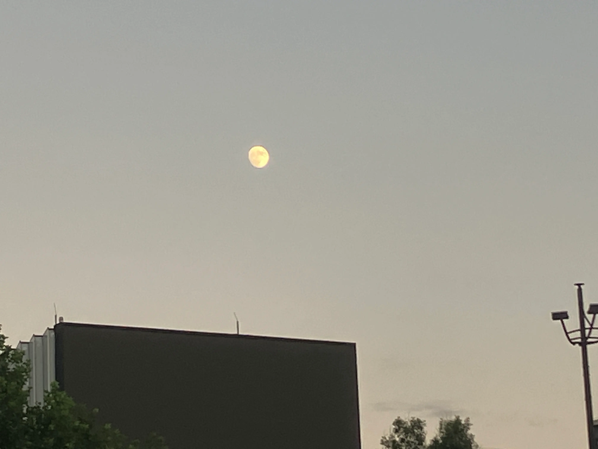

## 最后一站: 北京大学深圳研究院 信息科学工程学院-集成电路学院预推免

我又回来了, 北深:

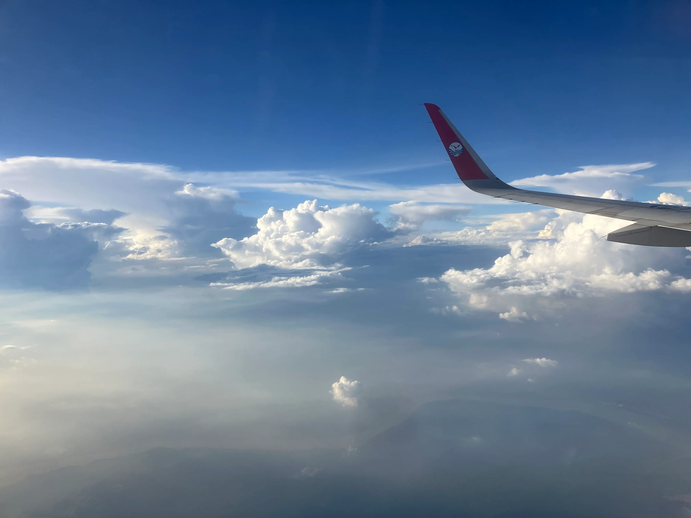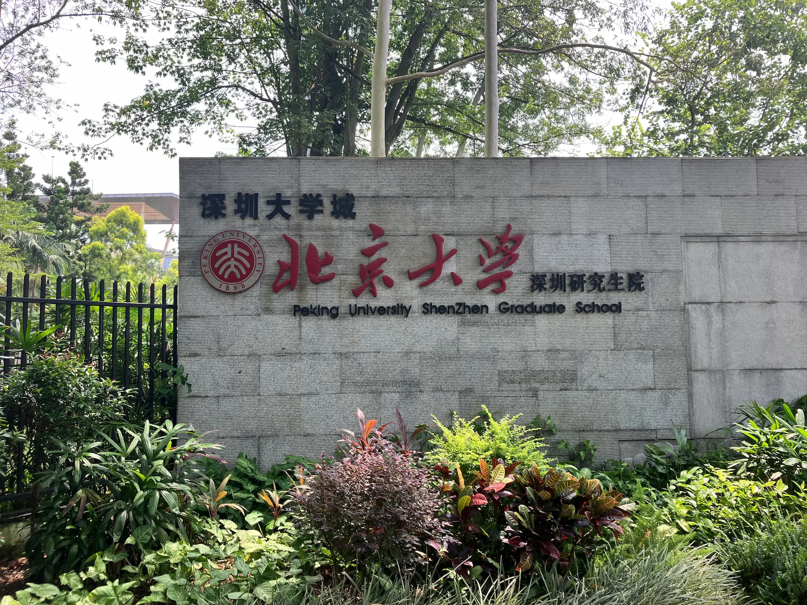

### 活动安排和内容

预推免时间: 9 月 16 日(上午 7 点签到)-9 月 17 日面试

注: 面试安排两天的原因一是老师人少, 二是参加学生多, 三是每个人应该都是强制面试满时间(20min), 算下来确实一天不可能面完.

### 面试前签到等

也是非常久违地定了 6 点的闹钟, 出门的时候还遇上附近学校新生军训早训, 买了俩烧麦就去赶地铁了.(本来是想买半笼饺子的, 但只能整笼, 故作罢)

也就俩月没来, 都忘记哪个口出站了, 记性依旧很差.

到学院门口约莫是 6 点 40, 已经有很多同学零零散散在各处等候了, 到 7 点老师开门, 便是签到, 核验和拍照环节.

值得一提的是, 似乎本次预推免并没有什么候补, 报名时 103 人(应该是), 面试顺序单上有 85 人. 而且老师还说得看签到情况确认安排, 可能根本没有过多通知候补, 甚至不安排候补.

当然, 就算这样的话, 按照去年 40 人的推免硕士比例, 也是远大于 1.5 倍的差额的.

说回签到, 需要带着学生证和身份证, 核验并签名, 以及当场查阅 4-6 级成绩(不会扫码). 托福和雅思应该是现场登录系统查验, 老师如此说, 但笔者并未看到, 故细节不清楚.

然后就是查看张贴的面试顺序, 一共两组, 我在一组 2 号. 同时只有两个组进行面试, 要面 20 个人, 一天就过去了, 所以两天确实情有可原. 就是可惜我多订了一天酒店的钱了.

正式面试前还要进行手持身份证拍照, 据说用于系统人脸识别等, 所有参与预推免并签到的同学均需拍摄.

然后就是直接转身上楼, 到走廊尽头的面试教室, 拷贝 PPT, 在外找个位置坐下等候了.

### 面试内容

> 本部分为虚构内容, 不构成任何参考意义.

8 点 37 开始, 我是第二, 在 9 点左右进教室. 提说一点, 北深允许自带文件进去, 所以我带了 5 份简历发给老师(并留下, 没带走), 然后带了 6 学期和预推免的成绩排名证明文件原件(因为报名的时候只有 5 学期的成绩盖章了).

老师首先提示是进行 2min 的英语环节, 然后 8min 的 PPT, 最后是自由问答, 示意准备好就开始.

#### 英语部分

英语问题是王老师问的: Do you play video games, can u share with us?(反正是这个意思吧, 我也记不清具体措辞了)

我回答: yes of course, i do like playing video games, especially the 3A-tiers, like The Witcher 3, Red Dead Redemption (2). I fell very immensed in these games, and sometimes i play for hours a time.

王老师: You say u play them for hours, do you fell tired or ?(没听清楚, 反正就是这个意思, 还有迷之微笑?)

我回答: Actually no. When the Black Myth Wukong released, i played the game over 10h a day, and it only took me 3 days to beat the game. And i'm also the fastest one among my friends. I kind of take them like... reading a book or the other way to watch a movie. (So, i'm always full of energy about them. 该说, 但好像没说)

#### 面试 PPT 部分

> 实话说, 我之前的 PPT 是按照 5min 的量来准备的, 所以竞赛和科研都没有展开, 最多一个一页. 但这次把国一竞赛展开成 3 页, 科研多展开了 1 页. 脱稿试了一下也就是 8min 30s, 所以稍微控制一点时间就能 8min 之内了.
>
> 注: 通知里面写的是 10min 自我介绍, 但实际 PPT 展示时间是要求 8min, 应该是拆分了英语的 2min.

这部分就没什么好说的, 贴个我的目录即可:

> 放 PPT 目录图

本来我是没做目录的, 但是 10min 的量我觉得东西太多, 需要先给老师明确一下大纲, 所以还是做了个目录. 并且其中的"拟进行方向"是通知里面要求加的(原话: 包括但不限于).

整体来说, 我这次由于展开了项目和科研的内容, 所以格外仔细地复习了写到 PPT 上的所有内容, 同时在复习的时候又拓展学习了不少东西(虽然最后面试都没用上...), 还是挺有收获的.

#### 自由问答环节

> 注: 
>
> 1. 没有考察任何专业课(指微电子相关)问题, 一个都没有. 准备半天白准备了说是.
> 2. 时间问满, 铃响才结束. 后面几个同学也是.

这里我有必要说一个观点: 面试情况很大程度上取决于运气, 如果老师恰好懂你的项目, 那可能问的很深, 同时还可能往专业课上探查你的相关基础. 但如果老师不懂你的项目, 就可能只能问些不痛不痒的问题, 或者老师抓不到合适的重点.

我的情况就是, 教室里面, 就似乎只有一个懂 CPU 的老师, 稍微在 CPU 相关问题上给了我一点压力. 但其他老师就没有问出什么有难度的问题, 甚至很多"偏题"的问题.

CPU 方面, 由于我的参赛项目是竞业达 RISC-V RV32I 指令集 CPU, 我个人陈述为: 主要负责了单周期 CPU 的完善实现, 和部分流水线的优化工作(文档这些就略了).

具体问的问题有:

1. 单周期 CPU 具体怎么实现?
   - (我理解还是硬件逻辑+verilog 上来回答的, 老师确实就是问的这么宽泛)
2. 流水线寄存器怎么实现?
3. 冒险如何处理, 拿结构冒险举个例子?
4. 如何区分不同的指令? 拿 I/J type 举个例子?(具体哪两个类型记不清了, 可能不是 I 和 J)
   1. 然后这个问题我自认为答得不是特别好, 于是老师接着追问了一下, 基本就是要我说出 green card 上的具体内容了. 我只能说我确实记不住完整细节, 但是我知道通过 xx 和 xx 可以进行区分.
   2. 确实很屋檐, 就这个是我复习的最少的, 我 PPT 都只给了半页, 反而 3 页的国一项目没人怎么问我.
   3. 所以说, 老师懂什么就问什么, 不太管你想强调什么.

然后就是一些不痛不痒的问题, 几乎所有老师都提了问, 由于基本没有关联, 我也记不清顺序了, 随便记录一下吧:

1. 论文中你负责什么部分, 公式推导, 撰写, 还是?
2. FPGA 项目中, 这个 ADC 选型有什么考虑?
   - 注: 这个是官方搭配的子卡, 而且本项目对采集要求没有那么高.

(好像还有几个比较"专业"的问题, 但我实在想不起来了)

然后是一些更为不痛不痒的问题:

1. 你的专业是在物理学院下面的?
   - what do u expect me to anwser?(我很想问一句我也想知道何意味, 但是还是认真回答了一下)
2. 有没有其他学校的 offer
   - 总之就是表示, 有, 但更想来北深.(此非假话)
3. 又忘了, 肯定还有但已经记不清...

至此便结束了, 所有的面试, 再见吧, 不, 拜拜吧.

### 面试后

由于我面试次序很早, 所以刚出来就有后面的同学围上来问情况, 我大致分享了英语, 以及整体氛围等. 顺势也和其他同学聊了不少东西. 天南地北, 甚至顺着我的 video games 聊到了各种游戏. 而且还有俩面试同学老乡见老乡环节.

内容太多就不多说了, 把和这些全国各地的同学聊天内容中的半小时展开, 都能写一篇比本文还长数倍的见闻/吐槽/经验贴. 但就此打住罢.

然后和一位计算机跨方向的同学一起边聊边走, 离开了学校. 这位同学后面接到了软微给他留位置的电话, 第二天便飞去软微了. 走前拍下了这张照片, 或许明年欢迎的就是我们.

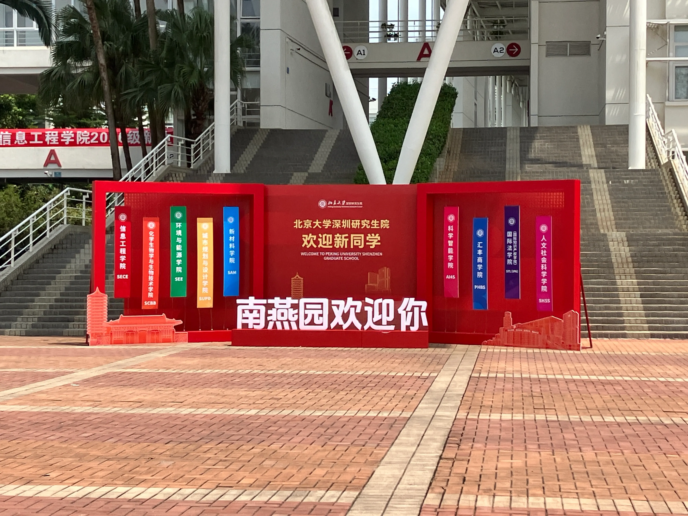

---

## 结果

9 月 20 , 北深 offer:

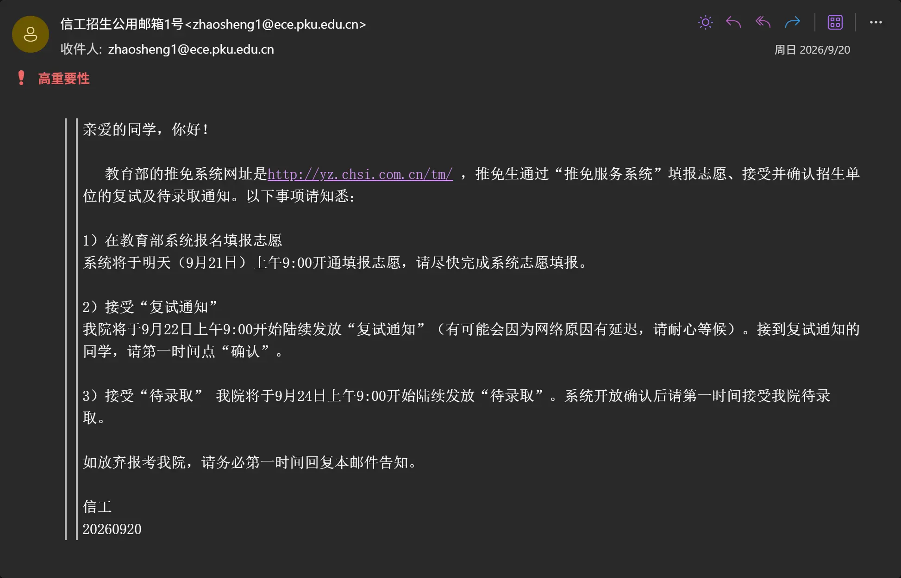

9月24日:

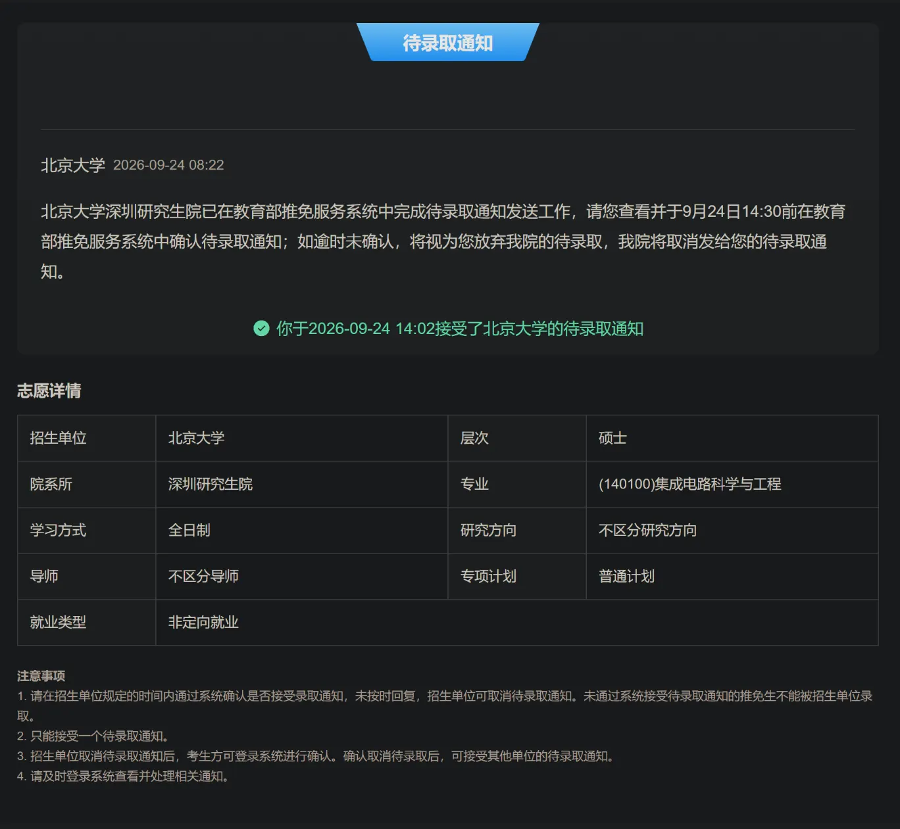

---

最后, 祝正在准备面试的读者和所有同学, 面试顺利, 最后去到心怡的学校, 选上有兴趣的方向和极好的导师.
