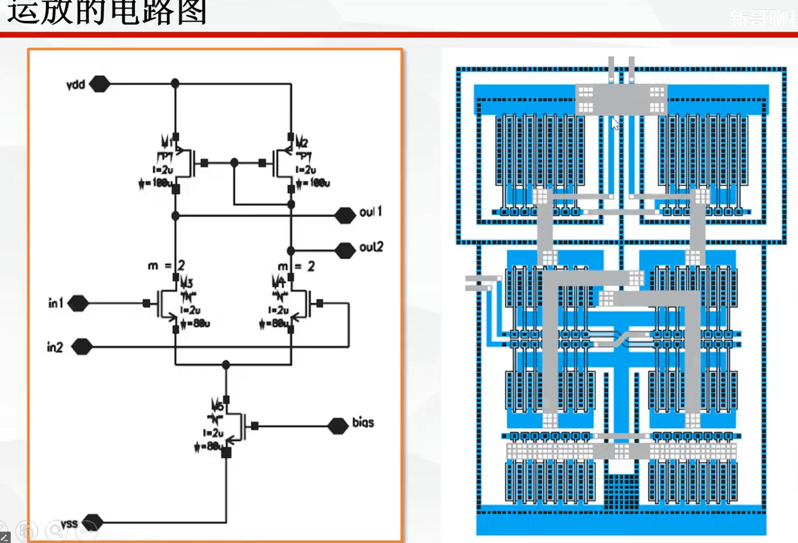
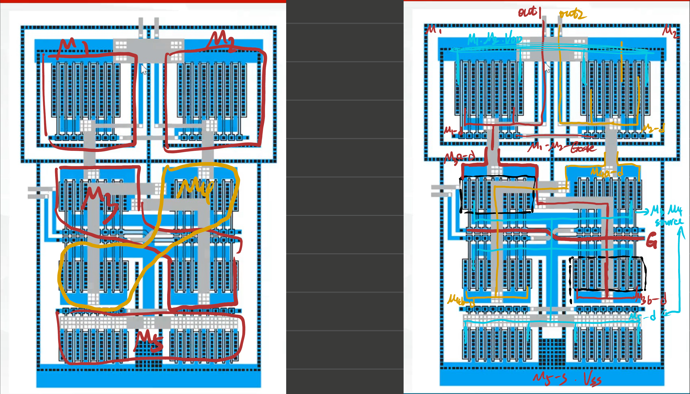
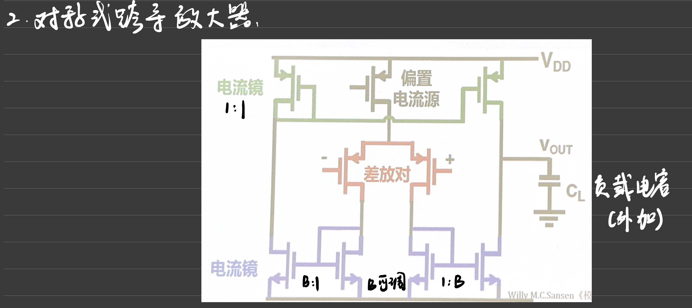
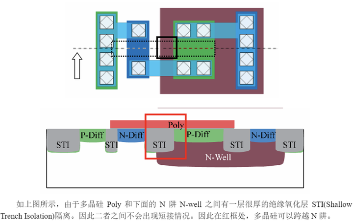

# 2023 级微电子大三下课程资料分享和学习建议

> 涉及课程: IC 设计基础, 集成电路原理, 微电子器件原理

本文涉及的分享内容大多为 PDF 格式的大文件、手写笔记等, 不适合放在 GitHub 上. 笔者也只有一个百度网盘的会员, 故通过百度网盘分享, 下载入口如下.

::baidu{url="https://pan.baidu.com/s/1GD-kmw8AAsZHMtPEepB_zQ?pwd=q8qa" title="微电子大三下 · 三门课程资料" code="q8qa" description="IC 设计基础、集成电路原理、微电子器件原理的笔记与学习资料."}

---

## 前言

本文主要内容为:
1. 笔者学习这 3 门课程时所做的笔记(以期末复习笔记为主, 随堂笔记较乱且内容大多在期末中没有考到, 故不做分享), 以及一些其他相关学习资料(均为个人整理)
2. 针对笔者当时的学习感受, 提一些学习建议. 该内容可能会逐渐过时, 请读者以自己实际感受为主.
3. 部分考题分享

注: 十分建议读者阅读2022级学长的期末考试植树: [四川大学微电子2022级大三下期末考试植树 | LiMingXiang's Record](https://love-learning-li.github.io/2025/06/18/2025_Spring_final_exam_reveiew/)

该内容具有较高参考价值, 对读者的学习和期末考试有较为深远的影响. 也建议读者去阅读学长的 Github, 里面还有其他宝藏.

---

## 资料分享

> 注: 
>
> 1. 笔者本学期主要采用 ipad + StarNote软件 的方式做电子笔记. **<u>笔记内的链接内容导出时发生丢失, 笔者暂没有好的办法解决</u>**. 若看到莫名其妙的空白, 很有可能就是这些丢失的链接本来应该所在位置. 这些链接部分是外部的文章等, 部分是本地的其他文件.
> 2. 笔者分享的做了笔记的教材, 其中标的重点都是考试之前复习标的, 或者上课标的, 并不一定(且相当一部分确实不是)是考试重点. 纯考试导向的同学请注意.
>    1. 笔者个人认为意义不是特别大
> 3. 可以看到笔记部分后续的图片比较好看, 而前面的是斜着拍教室投影. 这是由于笔者后期掌握了 ipad 的"扫描文档"功能. 前期的图就勉强看罢, 笔者也无心再处理了.

### 集成电路原理

资料清单如下:

1. 文件夹: 习题课
   1. 这是助教最后几节课分享的内容
      1. PPT 内容部分是 AI 生成(营养不多), 部分是同学的作业.
2. 笔记: 
   1. 笔者在期末, 依据平时的上课笔记和书上内容精简整理的.
      1. 基本不怎么包含PPT内容.
3. 教材
   1. 有部分笔者上课的即兴笔记, 以及期末复习时的一些笔记.
      1. 仅涵盖部分知识点

4. 无 PPT: 高老师的课向来是得不到任何官方 PPT 的.

### IC 设计基础

资料清单如下:

1. 文件夹: 其他网络资源
   1. 实际就一个版图的识别/绘制教程 PPT (源网址在首页), 这个讲的还挺不错的, 可以看看.
      1. 提到的保存方法:  [打印浏览器页面中 PDF 中的一种方法 - Asround](https://asround-blog.pages.dev/print-Edge/)
2. 笔记
   1. 笔者的课程笔记, 未经过任何整理. 所以有 PPT 页面等.
3. 作业: 有两个, 一个是笔者用于提交的源文件, 一个是最后期末时复盘的笔记.
   1. 源文件: 仅保留了课程强相关的知识部分, 什么 AI 生成视频的作业就删了.
   2. 复盘笔记: 就是复盘笔记.
4. 一个考试题目的简单批注.
   1. 五管 OTA, 建议读者自己把图扣下来自己标注和绘制一下, 加深理解, 笔者估计仍然是重点考题.

注: 本课程无指定教材, 也不发 PPT.

### 微电子器件原理

1. 文件夹: PPT
   1. 即任课老师发布的 PPT, 有少许错误.
   2. 同时, 第二章有笔者做了简单笔记的版本.(其他章节无)
2. 文件夹: 其他网络资源
   1. 主要是作业答案等, 读者可能自己已经找到了这些内容.
3. 文件夹: 习题课-助教
   1. 习题课的拍屏转换文件, 助教讲的还是十分好的.
   2. 注: 网络上一堆错误答案, 还是助教讲的准确率高.
4. AI_Prompt.txt
   1. 请读者自行阅读
5. 笔记
   1. 第二章详细总结: 当时笔者还有空, 稍微写的详细点.
   2. 本课程总笔记(复习笔记): 包括第二章内容, 以及参照网络内容进行的总结, 具体请读者直接看文件.
6. 教材
   1. 涵盖笔者上课时做的一些笔记

---

## 学习建议

### 集成电路原理

> 其实应该上"数集" , 这本书的内容可以说是数集的部分简化版

课程内容上: 

1. 该课程内容十分繁复, 注意补齐之前数模电以及模集的知识, 包括工艺的知识, 学起来可能会稍微轻松一点.
2. 和之前课程交叉的部分不是特别重点(似乎也不是考试重点), 重点是本书的新内容, 如存储器, 传输门电路, 动态逻辑电路, 时序逻辑电路以及STA分析, 和 A/D D/A 等. 这些内容本身其实不是特别难(笔者专门写了博客的 [STA](https://asround-blog.pages.dev/STA/) 除外) 认真看书还是可以理解大部分的.

老师讲解上:

1. 没有PPT, 这是老师习惯, 没办法
2. 高老师确实喜欢讲一些书上没有的, 但对本门课程来说, 可能后期还是比较贴近书上内容的, 不然根本讲不完
3. 建议构建自己的理解框架

考试风格上:

- 和高老师的其他课程差不多, 讲的又多又难, 其实最后还好, 就考一些重点内容, 而且没有那种思维上的难题

自学建议:

1. 大部分内容网上可以找到单独的知识点, 自学难度不大
2. 但笔者基本没怎么看网上的内容, 当然, STA 除外.

### IC 设计基础

课程内容上:

1. 非要说一个主线的话, 就是教你 Cadence 画版图
2. 课程内容和 AI 结合过于紧密
3. 作业和课程内容比较相关, 所以老师讲课时会强调认真听课
4. 老师在笔者的学期一直抱恙, 很多次课程都不能来, 或者来了也只能放视频
   1. 这无疑是极其让人沮丧的, 至少对于笔者来说, 对于线下放视频这种方式极为不感冒

老师讲解上:

1. 比较好的是, 一些重要知识点老师会多次强调
2. 认真听讲的话, 听懂老师讲的东西问题一点都不大, 考试考高分应该也可以
   1. 但是要多认真, 那就请读者自己把握了
3. 不可否认, 是能学到一点有用的知识的
4. 有些同学认为老师的讲解方式比较独到, 不过笔者认为一般(
   1. 总的来说没有什么特别颠覆性的内容, 都是那些东西倒过来倒过去
   2. 如果认为内容特别有启发的话, 笔者建议去多进行一些更有意义的训练. (诸如高中数学自由度)
   3. 当然, 仅限于笔者所在学期. 读者请以自己的体验为主
5. 老师上课喜欢让同学实操 AI
   1. 不过会用的觉得废话(比如笔者)
   2. 不会用的可能能学到一点

考试风格上:

1. 喜欢考原题, 但是有一点变种
2. 喜欢在上课的时候突然强调一个东西, 然后期末考
   1. 感觉可能是每届差异化的最大来源, 所以如果想考高分可以考虑注意认真听课
3. 题都不难, 建立在学过的基础上, 完全没学的话还是有难度

自学建议:

- 找别人的笔记学算了(考试的话)
  - 意思是: 网上没有系统性的课程, 因为本课程根本没有教材. 如果不听课连知识点都不知道有哪些, 更遑论单独搜索知识点来学习了.
- 学版图倒是很多 b 站资料, 但是笔者并没有兴趣, 所以没有深入学习, 无法提供很好的建议

### 微电子器件原理

课程内容上:

1. 可以说, 本学期最难, 内容特别多, 并且也较难, 同时需要一些认真理解才能学得好
2. 基本上就是PN结原理和BJT原理以及MOSFET原理的大展开
3. 同时公式也非常多, 如果不借助一些理解和记忆方法的话, 将会十分痛苦
   1. 所以说, 如果能构建较深的理解, 其实难度还好
4. 要学好(不是单纯考试分高), 和老师说的一样, 课下时间 > 课上时间
5. 作业很有难度, 且有些没有标准答案
   1. 通常情况是, 有参考答案相对还好, 或者AI辅助下来基本能做, 但想完全靠自己做还能拿到高评分, 那我说你就是万中无一的微电子器件天才.
   2. 特别有一些定性分析升降的题目, 同时有升和降的多个counterpart, 分析很难.
   3. 以及大部分计算题, 甚至公式你都不知道用哪个

老师讲解上:

1. 讲的很深, 某些地方比课本深入得多, 但是考不到(对于喜欢学这个的来说很好)
2. 会讲一些有趣的老故事和行业/军事趣事
3. 如果走神了一会儿, 恭喜你, 基本听不懂了
4. 如果预习过, 可能会轻松不少
   1. 大多数课都是, 但预习相对来说是比较奢侈的行为, 如果你很喜欢这个方向, 建议预习

考试风格上:

1. 老师会大致告诉考题的风格, 以及一些基本要求(最后的习题课时)
2. 相对来说最有难度的一门课
3. 往届考题参考意义不是很大

注: 最终这门课的打分非常高, 有一个题目笔者估计很多同学是没有答对的, 但是依旧得到了类似98 99的高分. 感觉任课老师要么给另一个完全不相干的答案也给了分, 要不就是本课程分有虚高.

自学建议:

- 网络资源特别多, 因为这本书是很多学校的考研教材
- 想学好, 课程资源绝对不会是一个问题

---

## 考试植树

> 注: 请以22级学长的文章为主要参考: [四川大学微电子2022级大三下期末考试植树 | LiMingXiang's Record](https://love-learning-li.github.io/2025/06/18/2025_Spring_final_exam_reveiew/)
>
> 笔者写这篇文章时已经很晚了, 大多数题目都记不太清, 特别是微电子器件.
>
> 其实刚考完是记得住的, 但得各地奔波夏令营, 准备复习准备文件... 真闲下来有时间写时已是今日... ...

就算记错了应该也差别不大, 反正是类似考点

### 集成电路原理

名词解释部分考了 ADC 的: 分辨率, 量化误差

其他学长总结的1-8的名词解释, 23级一个都没考. 至于其他考的, 笔者也忘了... 估计应该是变数最大的题

CMOS逻辑门, 动态逻辑电路都有考察, 方块电阻和存储器相关的内容笔者记不太清是否考察以及如何考察的了, 但笔者认为是重点, 还是多复习一下.

23 级放大器的考题, 笔者印象是考了一个稍微复杂点的. 首先肯定不是类似22级学长分享的各种简单的单级放大器, 其次具体细节笔者记不太清, 似乎是和电流镜有关的, 也或许是 cascode 等.

### IC 设计基础

首先, 基本上, 22级的所有图, 23级都重新出现过了

1. 五管 OTA 也考了, 但考的更简单, 学明白这个应该随便拿满分
2. 就是学长分享的原题, 下面这个图请务必仔细再仔细地看懂! 这个图并不难
   
   笔者做了批注的图:
   
3. 注意, 23级没有考"闩锁效应", 而是考的"天线效应", 这个在读者的上课笔记中有. 上课时老师只提了一句这个是重点, 然后最终就考了.
   > 致敬传奇效应 "闩锁效应", 这三门课每门课都在讲, 都要听麻了
   1. 据笔者所知有些同学只会写闩锁效应, 但仍然最后总评高分.
   2. 具体解答直接搜索网络, 或者看笔者笔记即可
4. 第四题, 图是和22级学长分享的一样的, 但是问题换了: 请问为什么这个结构叫"对称式跨导放大器"
   1. 这个也是老师上课的时候专门强调并解释了, 笔者笔记中也也有记载. 再次强调, 上课老师强调的内容很可能出现在考题中.
      
5. 基本可以说就是完完全全的原题, 这里使用学长的原图了:
   

### 微电子器件

> 注, 22级学长的个人网页中没有微电子器件的分享, 但其在个人知乎上的同名文章有:
>
> [四川大学微电子2022级大三下期末考试植树 - 知乎](https://zhuanlan.zhihu.com/p/1918762857232863779)

笔者基本已经完全记不清考了啥了, 只能以一些较为模糊的用词来描述.

首先笔者记得似乎是考了名词解释的, 具体考了什么真记不清了.

其次就是好像没有考学长分享的电流S曲线解释.

然后是少子分布图, 或者能带图, 应该是考了一个. 这个无需解释, 绝对是重点

提升频率的那个题应该没考, 取而代之的应该是一个小信号电路的题, 让分析某图为什么是共源级接法电路的小信号电路. 这个图笔者确实无法在教材上找到, 网络上搜寻一番也无果. 总之这个小信号电路绝非读者平常在模电或者模集中看到的那样简单, 其还有跨接在栅和漏之间的电容电感等(具体来说就是这些电容电感让小信号复杂多了). 本题笔者无法确认具体考点重点是什么, 大致应该还是小信号电路这一块的知识, 只能请读者多多注意了.(因为讲课的时候这部分较为繁杂, 容易漏)

计算题恕笔者确实记不清了.

