# 数字电路中时序分析的 setup 和 hold 分析

> 起笔于 9 月 17 日下午, 北深预推免面试一天后, 于某下午茶店铺中.
>
> 写给对 STA 中的 setup 和 hold 有一些了解, 但不太清楚的读者. 语言可能略显啰嗦.
>
> 若有错误和建议, 欢迎指出. 可通过顶栏中"关于"页面中的邮箱向我反馈, 感谢您的阅读和建议.
>
> (本文未使用 AI 辅助)

## 前言

最早, 笔者在学习数电之时就已经了解到了这个概念, 那还是大二刚接触时序电路的时候, 老师也没细讲具体的内容, 只说后面我们深入学习时, 会再次遇到这个重要的概念. 转眼便是大三下,  在数集的课程中终于又再次遇到了这个概念, 不过此时摆在课本上的, 已经是一个十分复杂的波形图了:

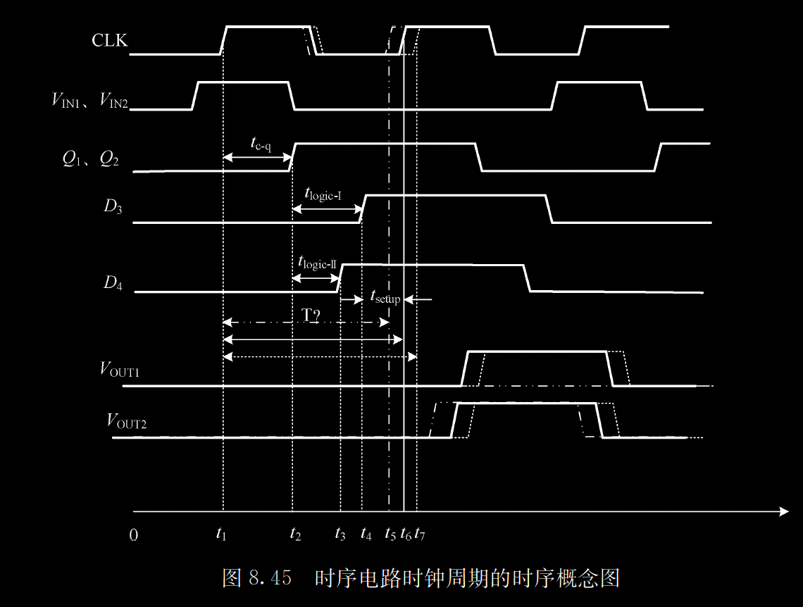

> 图源: 半导体集成电路第二版, P182.

由于各种各样的原因, 笔者在课上并没有对其建立起深刻的印象和理解. 考完试也已然进入保研季最忙碌的两月, 复习时也避不开这个知识点. 终在参考: https://zhuanlan.zhihu.com/p/278523793 文章, 并自行用软件在电脑上一步一步复刻波形图后, 自认为还有个不错的理解, 故成文分享之. 

复刻图如下: 

---

## 正文

### setup 和 hold 的基本定义

>  注: 
>
>  1. 本文讨论中, 时钟有效沿取上升沿.
>  2. 为方便, 本文不考虑时钟沿的上升和下降时间, 即认为沿的变化是瞬时的. 并且相对笔者上课时的教材(半导体集成电路第二版), 多考虑了时钟源到达 capture 和 launch 两个 DFF 的时间差($T_launch$). 此考虑参考了 https://zhuanlan.zhihu.com/p/278523793 .
>  3. 定义和描述等, 出于便于理解的考虑, 可能不够严谨, 读者若需要更加严谨的版本, 请以权威教材等为准, 本文只提供一种解读角度和理解方式.
>  4. 将 LHS 和 RHS 用于描述不等式的左右两侧, 不是很严谨.
>  5. 本文只到时序分析部分就结束, 而没有讨论如果违例会引起什么问题, 以及具体采用何种设计/硬件措施来解决违例. 这部分在网络上有很多资源, 若读者有兴趣请自行检索.
>  6. 再次提醒, 本文内容为笔者自己撰写, 自行审稿, 能力有限, 若有错漏还请谅解.

首先来简单认识一下 setup 和 hold 的定义:

- setup time: 在时钟沿到来之前一段时间中, 需要数据始终保持不变, 在更早的时候, 可以随意变化
- hold time: 在时钟沿到来后的一段时间中, 需要数据时钟保持不变, 在更晚的时候, 可以随意变化

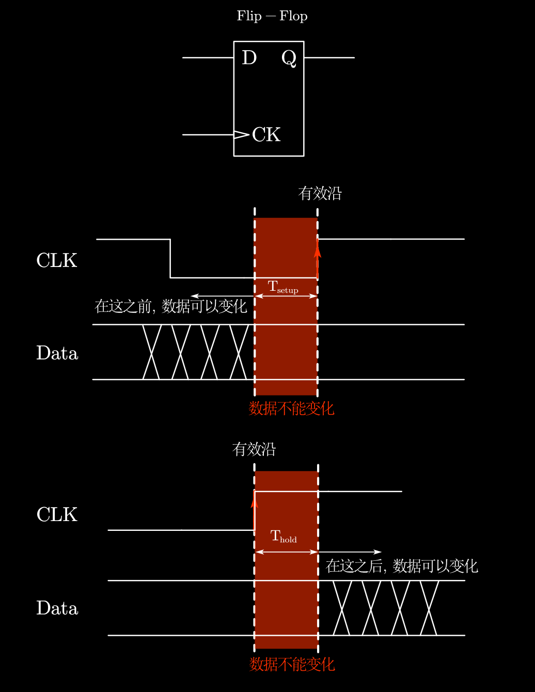

至于为什么有这两个定义, 以及 setup 和 hold time 具体有多长, 请搜索"CDC", "亚稳态", "MTBF"等关键词. 限于篇幅, 本文便不展开, 但读者可以考虑看看这个 b 站视频: https://www.bilibili.com/video/BV1U5zDBpESf/.

### 基本分析模型和时序图

这里需要注意的点是, 这两个定义是十分自然且简单的, 但为什么 STA 中, 我们却需要一个十分复杂的波形图+两个复杂得多的式子来描述时序约束条件?

 简单来说, 一个时序电路的路径上, 不是只有一个触发器, 而是"触发器0 --- 组合逻辑0 --- 触发器 1 --- 组合逻辑 2 --- ..."的长链路, 并且信号的传输不是一个数据传完, 再下一个数据(例如单周期 CPU), 而是流式传输, 或者流水线结构. 考虑多个寄存器, 数据端口一直在给出新数据, 等等问题之下, 我们就得考虑整个电路的配合情况, 以及数据传输的问题.

####  基本模型和图中参数

先来认识一下分析 setup 和 hold 时序的基本电路结构:

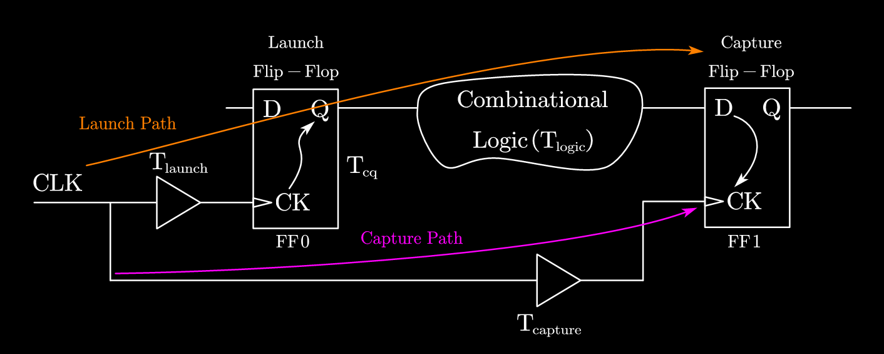

解读一下:

1. 图里有两个触发器, FF0 和 FF1, 读者可以这样认为: 现在的情况是, FF0 的 D 的数据需要发送(Launch)出去, 让 FF1 捕获(Capture)到. 我们重点关注的是 FF1, 他需要在满足 setup 和 hold 约束的情况下, 正确捕获接收 FF0 传来的数据.

2. 图里还有两条长箭头线:

   1. 一个是 Launch Path,  路径为: CLK(时钟源) ==> Buffer(Launch) ==> FF0-CK ==> FF-Q ==> Logic ==> FF1-D
   2. 另一个是 Capture Path, 路径为: CLK ==> Buffer(capture) ==> FF1-CK
   3. $T_\text{launch}$ 和 $T_\text{capture}$, 时钟源到达 launch FF (FF0) CK 端所需要的时间 和 时钟源到达 capture FF (FF1) CK 端所需要的时间.

3. 然后是认识一些参数:

   1. $T_\text{cq}$:  c (clk) 端时钟沿到达后, q (Q)端数据更新的时间, 也有将 cq 写作 c2q 的, 2 即 to(英语发音).

      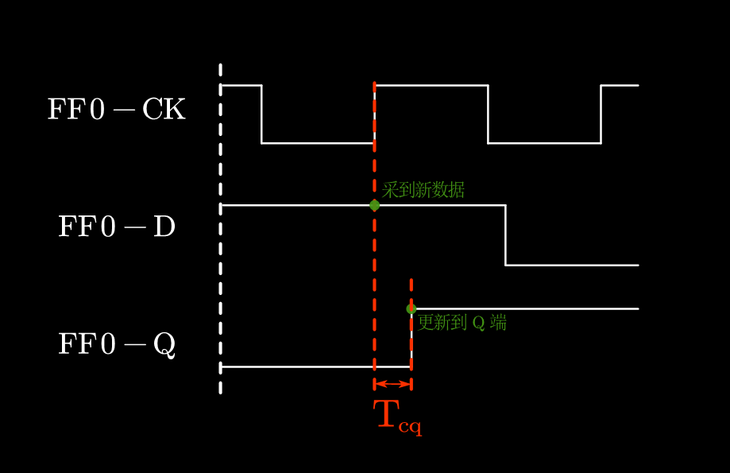

   2. $T_\text{logic}$: 组合逻辑延时, 指从 FF0 的 Q 端, 经过组合逻辑, 到达 FF2 的 D 端所需的时间.

      - 注意, 该组合逻辑的延时不是固定的, 在分析 setup 和 hold 的时候, 需要分别取最大值和最小值.(具体原因后面分析到再说)
      - 也有写作 $\color{red}T_\text{dp}$ 的, 意为 data path.

#### 其他参数 --- skew

这还不够, 我们还需要定义一个参数, 以方便后续进行分析:

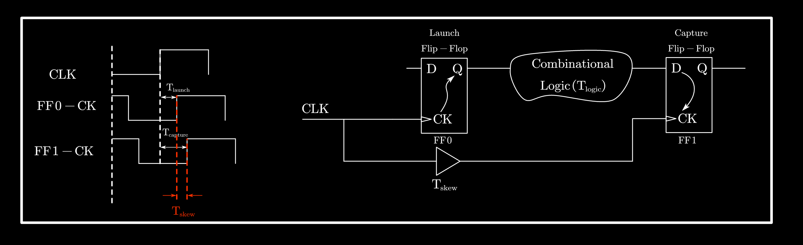

$$
T_\text{skew} \triangleq T_\text{capture} - T_\text{launch}
$$

可以理解为, 时钟到达 Capture FF 和 Launch FF 的时间差. 当 $T_\text{skew} > 0$ 时, 先到 Launch FF, 称为 "positive skew", 当$T_\text{skew} < 0$ 时, 称为 "negative skew". 这个参数是可以人为调控的, 在后面发生 setup 或者 hold 违例时, 可以通过改变这个参数来解决违例问题.

### 正式分析

#### setup 约束

根据前面的定义, 我们知道, 对于 Capture FF(FF1), 需要数据在时钟沿到来前的 $T_\text{setup}$ 时间前, 就要保持稳定. 我们先来分析一下, 当一个有效时钟沿到来后, Launch FF(FF0) D 端的数据, 要花多久才能到达 Capture FF(FF2) 的 D 端.

这个参数定义为 $T_\text{a}$, a 即 arrive.

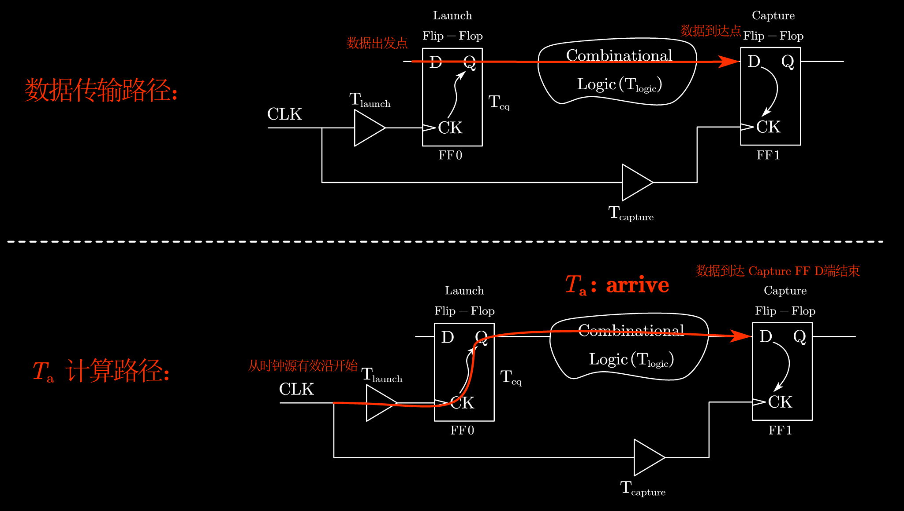

CLK 来临, 经过 $T_\text{launch}$ 到达Launch FF(FF0)的 CK 端, 再经过 $T_\text{cq}$ , D 端数据更新到 Q 端(这是 $T_\text{cq}$的定义, 时钟到来之后, 还需一定时间Q 端才能响应), 然后经过可长可短的 $T_\text{logic}$, 终于到达 Capture FF(FF1)的 D 端, 等待被捕获.

所以: 
$$
T_{a} = T_\text{launch} + T_\text{cq} + T_\text{logic}
$$

然后我们来考虑 setup 约束, 最极端的情况下, 对于下图时钟源上升沿来临后的 $T_\text{r}$ (required) , 数据才稳定. 但凡再晚一点到, 进入 Caputre FF(FF1) 的时钟沿前 $T_\text{setup}$ 时间范围内, 就违反了setup 约束.

 $T_\text{r}$ 是描述的 setup 极限不违例情况下的极端情况, 可以由 $T_\text{setup}$ 和其他参数定义如下:
$$
T_\text{r}=T_\text{capture} + T_\text{clk} - T_\text{setup}
$$

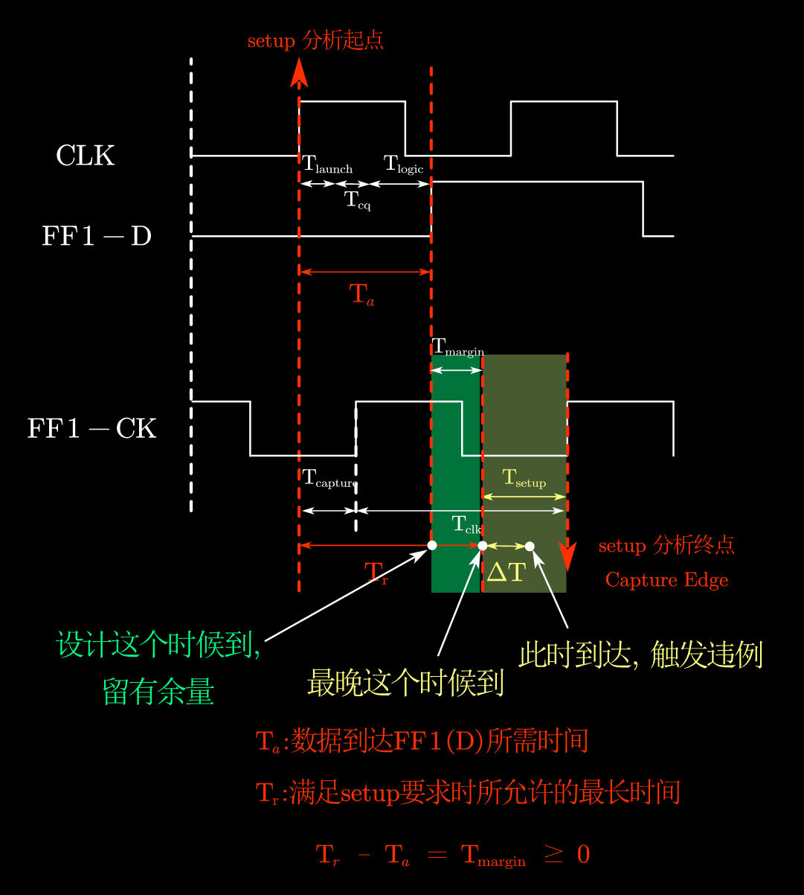

> 如上图, 如果数据由于各种各样的原因, 没有按照设计指标, 在 $T_\text{a}$ 刚结束就到达, 而是晚了一点点, 在绿色区域到达, 这仍然在设计余量内, 不会造成违例.
>
> 但如果设计失误($T_\text{margin}$太小, 甚至为0为负), 数据在最晚允许时间 $T_\text{r}$ 后才到达 (假设还晚了 $\Delta T$ , 如图), 将落入黄色的 setup 违例区域, 造成违例.

本图绘有的 $T_\text{margin}$ (也就是绿色背景对应的时间范围), 意指设计裕量, 其他地方也常用 **Slack** 来表示. 可以看到, 意指在设计时, $T_\text{a}$较短, 数据很快就到达了 Capture FF(FF1)的 D 端, 留了 $T_\text{margin}$ 的容错空间 (最极端情况下, 数据还能再晚 $T_\text{margin}$, 都不会违例).

读者可能会在 Quartus/Vivado 或者其他软件的时序报告页页面中, 见到过 WNS, TNS, 其意思就是 Worst Negative Slack 和 Total Negative Slack. 这里的 Slack 就是这么来的.

接下来, 就有两种数学和理解方式, 来得到 setup 约束的具体公式.

##### 第一种, 建立两个等式, 并分析极限情况

我们可以从 setup 分析起点(时钟源上升沿, 数据此后开始传输) 到 setup 分析终点(Capture FF 捕获传输过来的数据的时钟沿)之间, 建立一个等式:
$$
T_\text{a} + T_\text{margin} + T_\text{setup}= T_\text{r} + T_\text{setup}
$$
> 注: 
>
> 1. 起点终点不变, 直接看图还可以将 RHS 建立为: $T_\text{capture} + T_\text{clk}$, 这个其实也是一种分析方法. 后文在强调 setup 和 hold 分析的区别时, 会提这个内容, 读者也可以先思考一下这样建立 RHS 的意义.
> 2. 这两种RHS在数学上肯定是一样的, 但是实际的分析切入角度是不一样的.

将 $T_\text{a}$ 和 $T_\text{r}$ 展开:
$$
(T_\text{launch} + T_\text{cq} + T_\text{logic})+ T_\text{margin} + T_\text{setup}= (T_\text{capture} + T_\text{clk} - T_\text{setup}) + T_\text{setup}
$$
将 $T_\text{launch}$ 移到等式左边利用 $T_\text{skew}$ 化简, 可以得到:
$$
T_\text{cq} + T_\text{logic}+ T_\text{margin} + T_\text{setup}= T_\text{skew} + T_\text{clk}
$$
设计裕量需要大于等于 0, 所以:
$$
T_\text{cq} + T_\text{logic}+ T_\text{setup}\leq T_\text{skew} + T_\text{clk}
$$
同时, 可以看到, 如果要不违例, 我们希望 LHS 尽量小, RHS 尽量大. 但请回忆, 之前我们说, 组合逻辑的路径是有长有短的, 所以, 再考虑极端一点:
$$
\color{red}
T_\text{cq} + T_\text{logic,max}+ T_\text{setup}\leq T_\text{skew} + T_\text{clk}
$$

> 注: LHS 和 RHS 一般用于描述"等式"的左右侧式子. 此处(及后文)用于不等式, 并不严谨, 请读者注意.

在组合逻辑最长的情况下, 还能达到上式的要求, 那我们终于可以说 setup 约束是被满足的了.

> 注: 实际上 $T_\text{cq}$ 也有 max 和 min, 读者可以考虑一下应该取 max 还是 min. 实际上, 由于 $T_\text{cq}$ 和 $T_\text{logic}$ 都是  $T_\text{a}$  的组成部分(并且都是正的), 所以它们总应该同时取 max 或 min. 所以本文就忽略 $T_\text{cq}$ 的问题了, 认为在任何情况下都是一样的延时, 稍微缩短一点篇幅.

##### 从设计裕量(Slack)角度

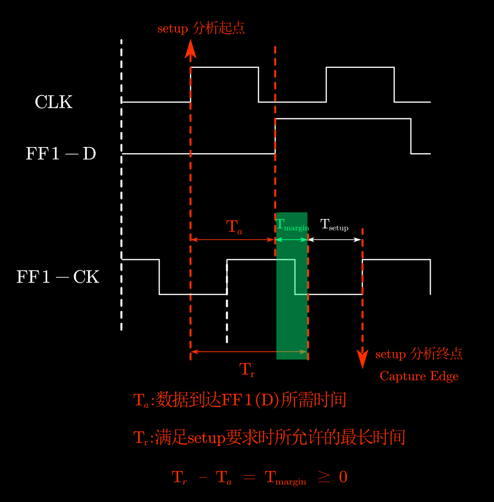

回顾一下 $T_\text{a}$ 和 $T_\text{r}$ , 前者是数据真实从 Launch FF 发出, 最终到达 Capture FF 的时间, 而 $T_\text{r}$ 的定义是, 允许数据最晚到达的时间. 所以, $T_\text r$ 和 $T_\text{a}$ 的差值, 就是设计裕量, Slack, 也即 $T_\text{margin}$:
$$
T_\text r - T_\text a = T_\text{margin}
$$
设计裕量需要大于等于零, 故:
$$
T_\text r - T_\text a \geq0
$$
带入 $T_\text r$ 和 $T_\text a$ 的表达式:
$$
(T_\text{capture} + T_\text{clk} - T_\text{setup}) - (T_\text{launch} + T_\text{cq} + T_\text{logic})\geq 0
$$
同时考虑 $T_\text{skew}$ 的定义, 可得:
$$
T_\text{skew} + T_\text{clk}\geq T_\text{setup} + T_\text{cq} + T_\text{logic}
$$
同样考虑最极端的情况, $T_\text{logic}$ 取最大值:
$$
\color{red}
T_\text{skew} + T_\text{clk}\geq T_\text{setup} + T_\text{cq} + T_\text{logic,max}
$$
可以看到, 两种方法得到了相同的完全相同的式子(不考虑不等号方向的话).

**<u>当然, 读者还可以从时序图中选择不同的起点和终点, 重新构造等式, 但大体和第一种方式无异, 故不赘述. 留给有兴趣的读者自行探索.</u>**

#### hold 约束

有了 setup 的分析过后, hold 的分析也就没那么难了.

我们依旧看图:

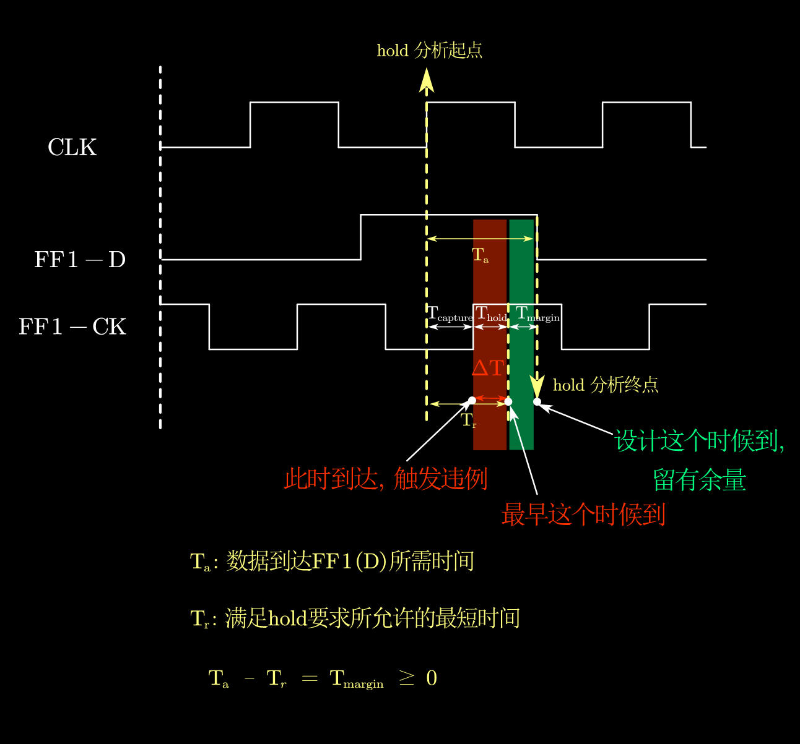

首先, $T_\text a$ 是雷打不动的, 和 setup 和 hold 都无关. 但显然, $T_r$ 的要求不一样. 在 hold 约束中, $T_r$ 也是数据到达的最极端情况, 但是描述的是允许到达的"最早时间"(注意, setup 中, 是允许到达的"最晚时间"). 可以设想(看图), 如果数据比 $T_r$ 要求的还早一点到, 那就落在 $T_\text{hold}$ 的禁区, 造成违例.
$$
T_\text r = T_\text{capture} + T_\text{hold}
$$

同样, 这里也可以和 setup 一样, 用两种分析方法来得到约束不等式, 但此处就不过多描述, 用最快的第二种方法:

同样的分析思路, $T_\text r$ 和 $T_\text{a}$ 的差值, 就是设计裕量, Slack, 也即 $T_\text{margin}$, 不过, 这次是 $T_\text{a}$ 更大(这很简单, 读者请思考为什么):
$$
T_\text a - T_\text r = T_\text{margin}
$$
考虑 $T_\text{margin} \geq 0$, 并带入 $T_\text r$ 和 $T_\text{a}$ : 
$$
(T_\text{launch} + T_\text{cq} + T_\text{logic}) - (T_\text{capture} + T_\text{hold})\geq 0
$$
考虑 $T_\text{skew}$ 的定义, 可得:
$$
T_\text{cq} + T_\text{logic}\geq T_\text{skew} +T_\text{hold}
$$
此时, 比较敏锐的读者要说: "我知道, 这个时候要考虑极端情况, 取 $T_\text{logic}$ 的最值带入了!" 非常正确. 我们希望LHS 尽量大, RHS 尽量小, 以尽量让 hold 违例不发生. 极端情况就是 LHS 的 $T_\text{logic}$ 最小, 即:
$$
\color{red}
T_\text{cq} + T_\text{logic,min}\geq T_\text{skew} +T_\text{hold}
$$

> 同样, 考虑细致一点, $T_\text{cq}$ 也应该取 min.

### 公式总结, 解决违例

至此, 我们就得到了 setup 和 hold 的约束不等式, 也是作业和考试中会用到的:
$$
\color{red}
\begin{cases}
T_\text{skew} + T_\text{clk}\geq T_\text{cq} + T_\text{logic,max} + T_\text{setup}
\\
\\
T_\text{cq} + T_\text{logic,min}\geq T_\text{skew} +T_\text{hold}
\end{cases}
$$
但是, 还有一个问题: 如果不等式不成立(即发生违例), 我们应该如何处理, 才能解决违例呢?

其实很简单, 对于:
$$
\text{LHS} \geq \text{RHS}
$$
这种不等式来说, 如果不满足, 那就是: $\text{LHS}$ 太小, 或者 $\text{RHS}$ 太大. 要解决的话, 就:

1. 增大 $\text{LHS}$ 中的某些项
2. 减小 $\text{RHS}$ 中的某些项

对应到具体问题中, 如果遇到 setup 违例:

> 注意, 本文未考虑 $T_\text{cq}$ , 也未考虑改变 $T_\text{setup}$ 和 $T_\text{hold}$ 本身.

1. 采用 postive skew ($T_\text{skew}$>0)
2. 降频(增大 $T_\text{clk}$)
3. 想办法降低组合逻辑延时(减小$T_\text{logic}$)
   - 具体方法不少, 但本文不再展开

如果遇到 hold 违例:

1. 采用 negative skew ($T_\text{skew}$<0)
2. ~~超频(增大 T_clk)~~ (表达式都没有$T_\text{clk}$, 别乱写!)
3. 想办法增加组合逻辑延时(增大$T_\text{logic}$)

可以发现, 在 skew 和组合逻辑上面, 两种违例的解决方法是相反的, 也就是说, 通过调整某个参数(不包含时钟周期)来解决某一违例, 势必会让另一方裕量减少(严重情况下甚至违例), 这是设计时需要 Trade-off 的. 并且, 读者需要意识到, 长时序逻辑的路径上, 不是只有一个 Launch FF 和一个 Capture FF 的, 而是当前 FF 既是上一级 FF 的 Capture FF, 也是下一级 FF 的 Launch FF. 如果减小时钟源到这个时钟的延时, 相当于减小上一级时序中的 Capture(让上一级的 Skew 增大, hold 的 Slack 更小), 同时也减小了下一级时序中的 Launch(让下一级的 Skew 增大, setup 的 Slack更小.). 所以说时序问题是很复杂的, 处处都需考虑. 此处不再展开, 因为笔者也了解的不多(此乃真话).

---

### 补充内容 --- 为什么 Tclk 影响 setup 不影响 hold ?

> 可能是面试中的好问题, 笔者准备了一阵, 但无人询问, sad :( 
>
> 此处不给出标准答案, 读者可以在自己理解的基础上自行组织语言, 这更考验对之前内容的掌握和凝练回答的能力. (绝对不是这部分要写清楚需要补充很多图和解释)

如果说, 你只是想大致了解一下 setup 和 hold 的内容, 那前文的内容已经差不多够你入个门, 应付一些常规的面试问题. 但是笔者在复习中, 遇到一个很有意思的问题: **<u>为什么 Tclk 影响 setup 不影响 hold ?</u>**

该问题笔者也和室友很是讨论了一阵, 成文时觉得有必要在这里补充一下. 如果有兴趣, 欢迎读者也一起来思考.

请读者注意前文已经出现的这张时序图:

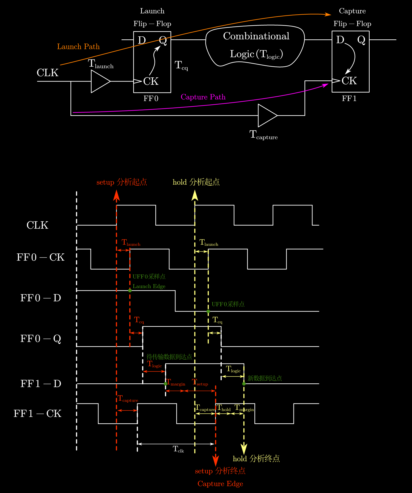

可以看到, 图中专门标出了 setup/hold 分析起点和终点. 在前文的介绍里面, 似乎这没什么特别的, 作用不过是用来建立等式, 导出不等式而已. 甚至不选图中标的起点终点, 随意选取其他的起点/终点, 也可以建立等式, 同样也可以导出一样的不等式.

但是其实, 这里的 setup/hold 分析起点和终点, 是有明确的实际意义的. 读者可以尝试, 是否能在其中明确找到 $T_\text{clk}$ 的存在, 并想清楚为什么它在里面, 又和起点终点有什么联系?

在给出提示之前, 笔者想请读者思考一个问题: **<u>之前解决违例的时候, setup 违例可以用降频(本质 $T_\text{clk}$ 增大)来解决/缓解, 但 hold 却不能通过调整 $T_\text{clk}$ 来解决/缓解, 这是为什么?</u>**

你可能会说: 你不是说看不等式不就完了? 让不等式一边变大, 一边变小就行了. hold 那个不等式根本就没有 $T_\text{clk}$ 这一项, 调了肯定没用啊.

这当然没错, 但, 为什么 setup 的不等式有( $T_\text{clk}$ ), hold 就没有呢?

这本质上其实要回到, setup 和 hold 的那两个不等式, 其形成的约束, 本质是**<u>在解决什么问题</u>**. 这里将公式再次复制于此:
$$
\begin{cases}
T_\text{skew} + T_\text{clk}\geq T_\text{cq} + T_\text{logic,max} + T_\text{setup}
\\
\\
T_\text{cq} + T_\text{logic,min}\geq T_\text{skew} +T_\text{hold}
\end{cases}
$$

> 读者可以先自行思考, 然后看后续解释.

不妨思考一下其物理意义, 是否符合这两句话:

1. setup: **保证数据可以在下一个上升沿来了前, 传递到寄存器 D 端, 能够正确被捕获采集到.**
2. hold: **保证新数据不会来的太快, 防止在旧数据被捕获采集前, 就将其顶掉.**

然后再看看下图:

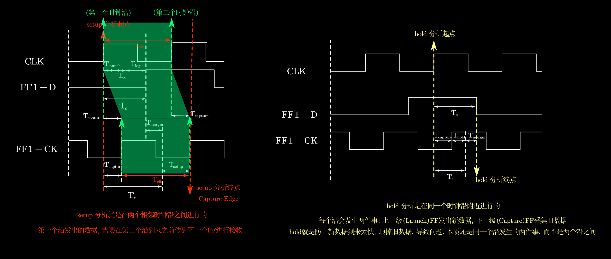

笔者在本图中明确地标出了$T_\text{clk}$ 的存在, 并给出了简单(并不十分严谨)的说明. 结合:

1. setup, hold 的定义
2. setup, hold 的实际/物理意义
3. 每个时钟沿到来后, 不同 FF 的具体行为

综合分析这个问题, 希望读者能得到一点启示, 并总结出自己对这个问题的理解.
