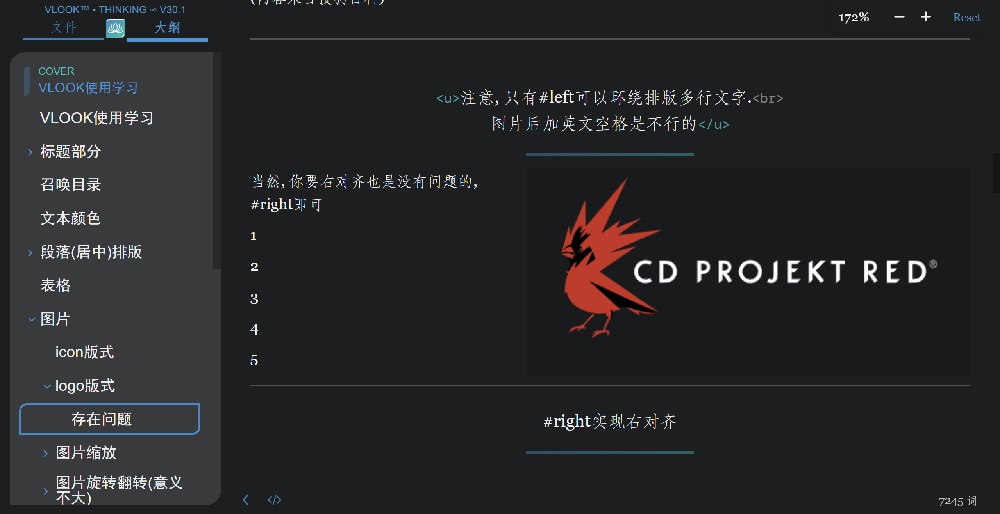
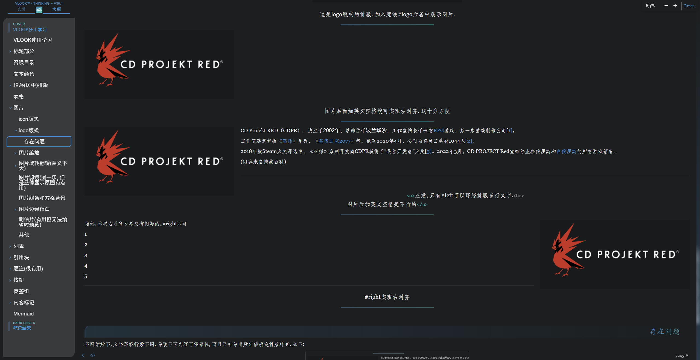
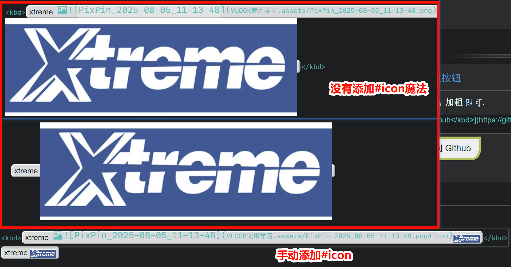

# VLOOK使用感受与问题收集

## 前言

​	传统 Typora 我已经使用了两年有余, 记了不少笔记, 也用 github 上开源的 [Latex 样式主题](https://github.com/Keldos-Li/typora-latex-theme) 写了一些要求不高的课程小论文. 一开始只会基本的标题列表和表格功能, 后面需求变多变细, 又去了解了一些简单的 html 语言辅助编写(最常用的就是文本颜色, 图片并排展示, 文字居中加粗作为表头, 还有导出pdf分页), 但分栏这个需求始终没有解决. 当列表内容较为简短时, 能分栏即可更高效地利用屏幕空间, 而不至于大部分内容全在左半页, 导致内容及其稀松, 导出 pdf 也极为冗长.

​	前两天写笔记时又出现需要分栏的情况, 于是搜索一番便找到了 [VLOOK](https://madmaxchow.github.io/VLOOK/). 目前刚刚完成基本内容的了解和使用, 也就趁着记忆还较为清晰时写一些东西, 兴许还能启发一些与我有同样需求的人.

注意:

- 个人比较看重编辑时能直接预览的特性, 故而对于只能导出HTML才能预览到的功能, 没有过多了解
- 基本了解方向和倾向集中于自己的个人需求. 我需要什么我才(重点)看什么
- 本文所有评价性用词和内容, 均结合个人使用习惯和好恶, 请勿过度解读
- 作者没给我打钱(当然我也不是什么知名人物就是了)

## 最有用的功能

​	以下我会列举这几天了解下来, 我觉得可能会对我后续使用Typora编写起到明显帮助的功能, 排名分先后, 但相邻内容差距不一定大.

1. 分栏功能

   - 引用块, 列表. 结合图片, github style alert等, 让排版一下丰富起来. 并且语句不多, 容易实现.

   - 毋庸置疑的最有用的功能

2. 折叠功能(基于引用块和六级标题)

   - 实际编写中使用很能节省(赛博?)纸张

3. 段落居中排版

   - 使用简单的下划线, 加粗和高亮实现(并且容易取消)
   - 之前只能使用HTML实现, VLOOK此功能实现了几乎完美的替代

4. 图片排版中logo版式侧对齐的环绕文字排版:

   - 试过typora图片文字混排都知道这有多折磨
   - VLOOK的这点做的还算不错, 就是目前有一点小bug(后文提)

5. 按钮, 标签

   - 丰富排版

6. 刮刮卡

   - 复习神器
   - 但是还是导出HTML才好用

7. 题注

   - 稍微专业一点的排版里面很有用

​	

​	其他功能对我的使用频次应该不会很高, 因为没有太高需求.

## 目前遇到的一些问题

> 截至本文上传时.

1. 图片logo侧对齐(左对齐/右对齐)排版时, 环绕文字排版效果在不同缩放效果时不固定, 如下图:
   

   

   - 也就是说, 无法精准控制字数来达到任何情况下都做到统一的排版样式.
   - 这点在上文提到的github 上开源的 [Latex 样式主题](https://github.com/Keldos-Li/typora-latex-theme) 中, 有很好的解决, 因为它始终将页面按照一个A4的宽度进行渲染, 当缩小到能看到页面侧边缘时, 导出的效果就是和你能看到的一样.

2. 图片按钮并不能自动识别为`#icon`版式.

   - 如图:
   - 个人推测可能是图片格式的问题(?), 因为官方文档建议使用.svg格式图片, 但手头没有, 就使用png格式试了一下.

3. 打开markdown文档时Typora无响应.

   - 一般是在有一个使用VLOOK主题的md文档打开时, 打开其他文档很容易打不开(typora新窗口一直黑着, 什么也不显示)
   - 一般来说, 关掉所有md文件然后再打开可以解决.

4. 官方文档有一些错别字, 例如markdown打成mardown(在手册进阶里面有), 其他的没什么印象, 但可能还有, 建议作者有空可以考虑排查一下.

- 印象中还有一些其他小问题, 但没有做记录, 且感受不明显, 所以并没有印象了.

## 亮点

​	开发者本来就是基于导出HTML进行使用的, 所以导出后的HTML莫名的很好用. 首先是及其适配的排版和各种语法魔法(VLOOK的一种语法)的配合, 然后就是各种小功能, 如聚光灯, 图片/表格等固定小窗.

​	这让Typora编辑的文档在个人本地使用变得及其舒适, 特别适合自己观看, 或者投屏进行讲解/汇报.

## 美中不足

分享给他人不是很方便

- 虽然网页支持导出pdf, 但效果还需精进, 最大问题是导出时不附带书签, 让长文档阅读体验骤降. 导出的html还需要打包图片才能再本地让他人观看, 这和typora写的md文档弊端一样.

- 采用作者建议, 用github pages搭建了个人静态网站, 但网站访问速度不够稳定. 不能作为导出pdf分享的替代方案.
  - 目前还是希望导出pdf功能做的更好, 最好可以支持暗色模式导出(个人偏好)

## 其他评价

​	作者在 b站 也有发布内容, 评论中有些类似"本末倒置"的评论, 似乎意在指责其过于复杂, 增加的繁多内容让Typora的使用"失去了初心", 变得不够简洁也不够方便了.

​	这点上, 仁者见仁智者见智. 我同意某些功能的实现有些过于复杂了, 而且大部分用户完全用不上. 但作为用户, 也可以自行选择自己要使用的功能, 其他功能只要不挡道不影响正常使用即可(如果影响了, 那说明其实也没那么难实现). 追求简洁的用户完全可以仅使用分栏功能, 而这做的其实是相当简单的, 也很好用. 有更多排版需求的用户也可以在作者给出的框架下实现自己的需求, 功能多到让人吐槽, 也反映出作者考虑周到, 或者说听取用户需求进行积极扩展.

​	而且, 最本质的问题在于, 如果你觉得原本的Typora够用了, 那你完全没有必要看VLOOK, 看VLOOK并需要使用他的人, 并不会觉得它过于复杂, 毕竟对比起原生html和难用的word, 它还是相对简单的. 学习成本上, 能从零学习markdown语法的人, 不会在学习VLOOK上遇到太多困难.(就像有人依然觉得Typora语法太过复杂一样, 或许这类人本身就不适合Typora, 而不是Typora不适合他们)

## 总结

​	这是一个光「分栏」功能, 就值得我去一试的项目. 对于觉得原生的Typora不太能满足你的使用需求, 并且愿意一些花时间和精力, 在其中探索的朋友, 或许你还能发现自己喜欢的功能.
