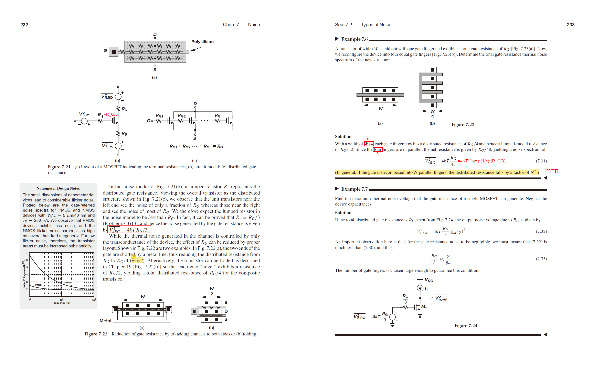
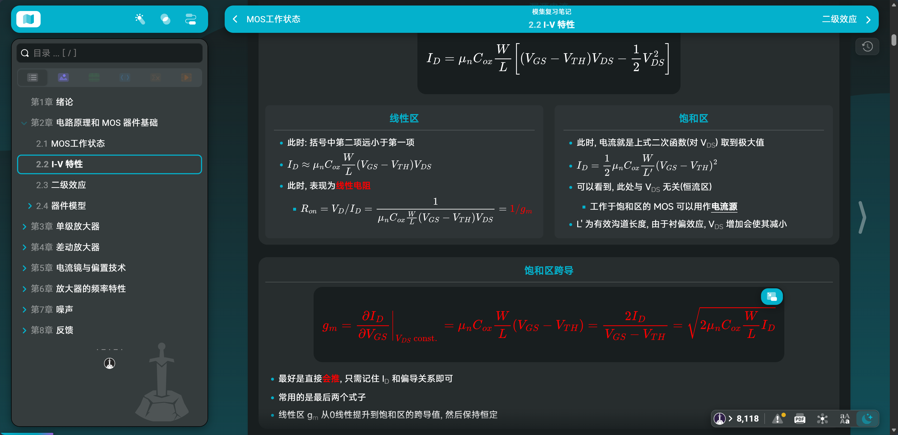

# 模集期末复习个人整理资料分享

所有资料在本人 github 仓库中: [Asround/Learning_resources_sharing: Sharing some learning resources in IC.](https://github.com/Asround/Learning_resources_sharing)

本文对应资料在: [Learning_resources_sharing/个人编辑/Analog_CMOS at master · Asround/Learning_resources_sharing](https://github.com/Asround/Learning_resources_sharing/tree/master/个人编辑/Analog_CMOS)

以下简单介绍一下资料内容

---

## 电子书教材

只提供了英文版教材, 原因:

1. 中文版电子教材十分模糊, 可读性很差
2. 任课教师上课时 PPT 几乎全英文(只有部分专业名词和生僻词/词组使用中文标注)
3. 英文教材编写组织和可读性个人认为较好

提供的英语电子版教材有如下特点:

1. 可以直接使用 Acrobat 编辑, 没有强制签名限制
   - 使用了 Acrobat 的"提取页面"做了绕过
2. 后面部分章节有笔者上课随记批注.
   - 内容仅供参考, 不保证绝对正确.

特别说明: 任课教师强调 PPT 不能上传网络, 并且 PPT 不属于 "主要由本人负责编写" 之类, 故不在网络上提供, 还望读者知悉.

---

## 期末复习笔记

任课老师在上课期间会反复强调部分知识点, 期末考试之前的一节课也会再次说明, 这个资料的内容即是如此得到的.

但是毕竟时间有限, 整理匆忙, **若内容有误, 还请见谅**.

- 文件提供:
  - .html: 方便查看, 排版好看, 有可导航目录. 用任意电脑浏览器打开本地文件即可
    - (注意, 不可将"模集复习笔记.assets"与之分开, 须保证和 .html文件在同一目录, 否则无法加载图片)
  - .pdf: 方便多端查看, 可脱离图片文件夹, 但排版不甚好看.
  - .md源文件: 如读者使用VLOOK, 可以按照自己的需求直接编辑并导出, 实现个性化调整.
