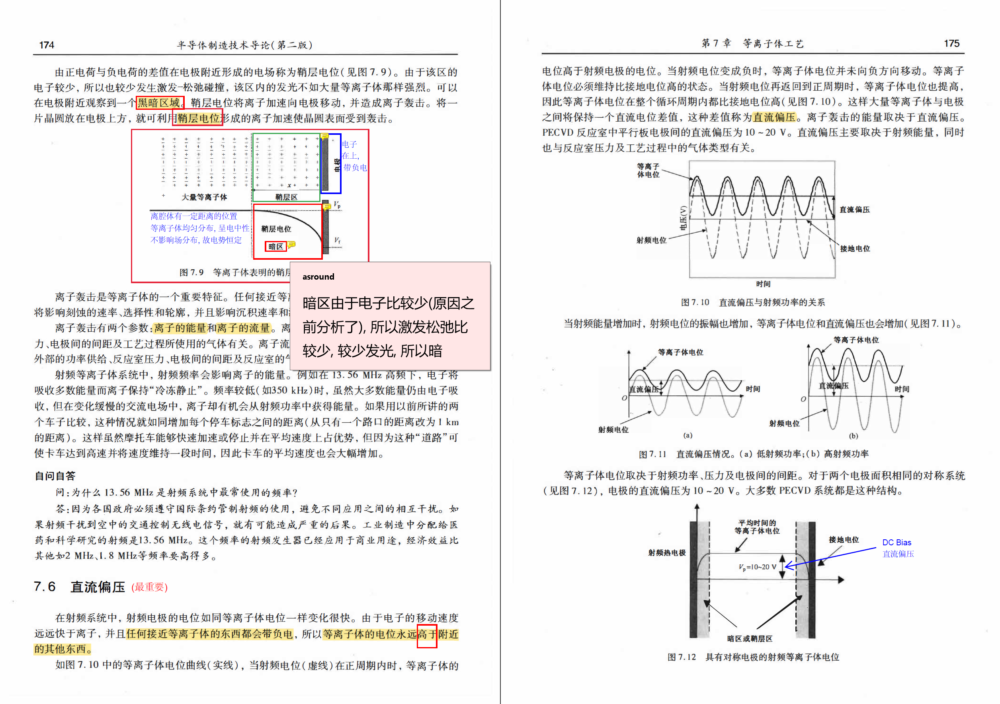
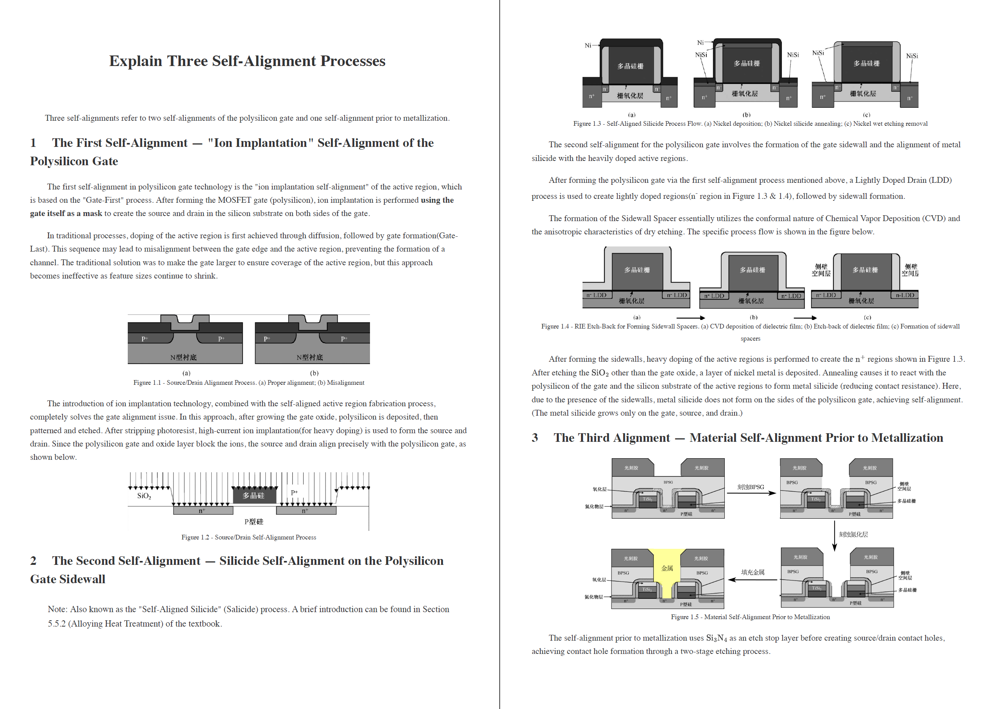
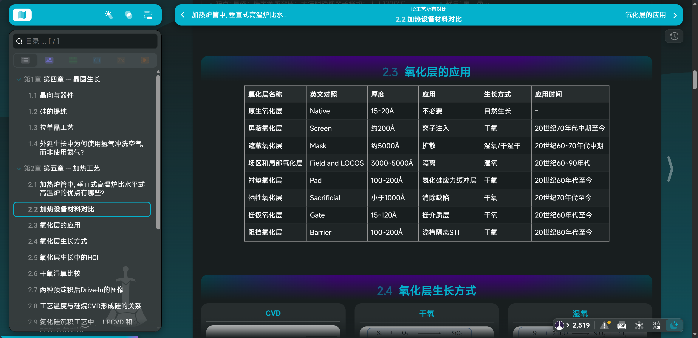

# 半导体材料与IC工艺课程资料分享

所有资料在本人 github 仓库中: [Asround/Learning_resources_sharing: Sharing some learning resources in IC.](https://github.com/Asround/Learning_resources_sharing)

本文对应资料在: [Learning_resources_sharing/个人编辑/IC_Process at master · Asround/Learning_resources_sharing](https://github.com/Asround/Learning_resources_sharing/tree/master/个人编辑/IC_Process)

注意, 由于原电子书文件太大, 拆分为5个pdf文件上传, 读者需要自行考虑合并. 若想直接下载全书, 笔者还提过百度网盘下载:  [下载链接](https://pan.baidu.com/s/1_CpSG9GEFBVhUAU6JBJaHQ?pwd=1228)

以下简单介绍一下资料内容

---

## 电子书教材(带有详尽笔记)

笔记均为笔者在上课期间, 使用笔记本电脑, 通过 Acrobat 软件记录. 推荐读者也使用 Acrobat 阅读.

笔者认为勾画和笔记基本涵盖了所有上课提到的重点(广撒网当然没问题哈哈), 但还请读者注意任课教师是否在本学年教学时有重心微调.(任课教师提到会根据往届情况适当调整)

---

## 十个问题

该内容为课程期末作业, 目的是让同学们边整理边复习(重点还是复习), 并且将一个你认为有价值的内容使用英语展开回答.

> 笔者希望可以给同学们一些选题启发, 但不希望有任何照抄行为, 这违背了分享的初衷.
>
> 同理, 本资源不提供 markdown 源码

所有内容都**尽可能基于教材**, 以及询问老师(**上图展示的内容书上是不全的, 笔者也是找老师探讨两次才完全弄明白, 然后自己绘制的全工艺流程图**), 其次是上网查询, 最次是询问 AI. 故读者基本可以相信本文的内容正确性. 但本书毕竟只是"导论", 笔者在书写的时候发现很多工艺比书上讲的复杂得多, 故而读者查询到一些不一样的信息时, 注意多方考证.

并且本资源提供 markdown 源码, 希望有读者可以在学习之余将这些对比相关的内容整理得更好, 然后分享出来.

---

## 所有对比

任课老师上课反复强调: 凡是涉及到对比的都是重点

所以本人花了约莫不到两小时的时间, 在考试前两天通过快速截图PPT+AI辅助OCR输出markdown表格的方式, 整理了这个文件. 由于时间确实匆忙, 所以基本只是"搬运", 没有太多的解释, 需要读者自行回到PPT或者教材中查询详细信息.