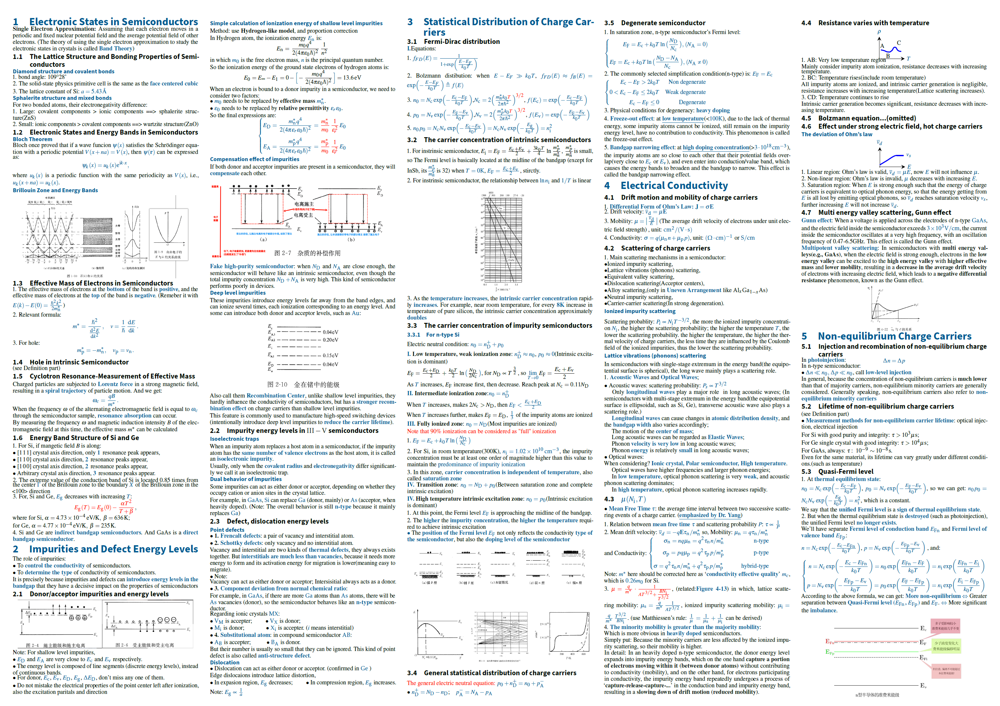

# 半导体物理CheatSheet分享

- 请到github仓库(后文有链接)下载 pdf 查看以获得更好体验

## 说明

仓库地址: [Asround/Semiconductor-physics-CheatSheet: A latex CheatSheet for Semiconductor Physics. Book reference: 半导体物理学(第8版) - 刘恩科](https://github.com/Asround/Semiconductor-physics-CheatSheet)

1. 请使用 latexmk 配方
2. 沿用了英语书写的方式, 但没有过多时间校对每个专业名词的合理性, 请读者注意
3. 内容根据 <半导体物理学(第 8 版)>(刘恩科) 进行整理, 插图除笔者使用 Tikz / AxGlyph / 手动 绘制以外, 均来源于该书
4. 第 8 章内容整理较少(限于篇幅和时间), 但为本人学年度期末考试重点章节, 请注意勿被误导
5. 笔者仅使用课后时间匆忙整理, 若有错漏还请见谅, 一切以书上内容为准.

## 下载地址

1. 项目仓库下载: [项目仓库](https://github.com/Asround/Semiconductor-physics-CheatSheet)
2. 仅 PDF 下载: [pdf下载](https://github.com/Asround/Learning_resources_sharing/blob/master/%E4%B8%AA%E4%BA%BA%E7%BC%96%E8%BE%91/Semiconductor_Physics_CheatSheet/SPCS%202026.pdf)