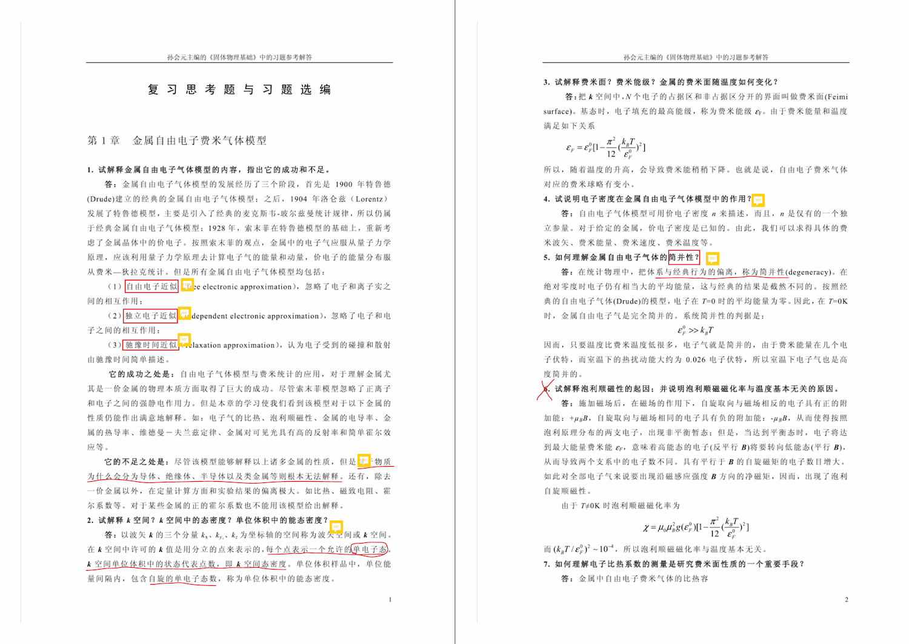
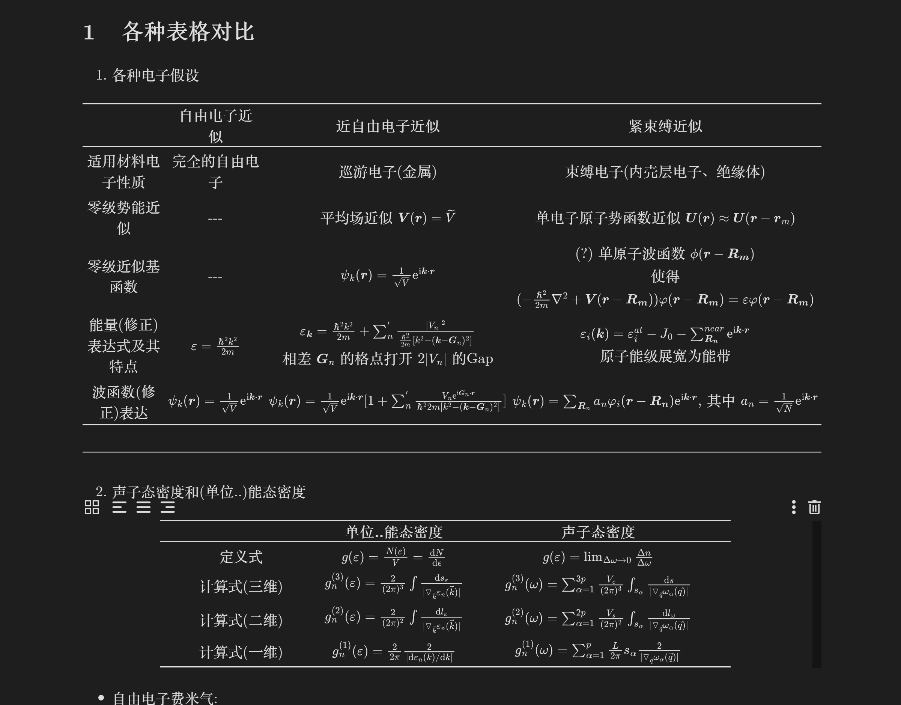

# 固体物理课程资料分享

> 笔者在编写个人网页的时候顺带翻了一下之前学期的文件夹, 发现这些可以放到网站上作为分享, 故写之. 但由于时间跨度较长, 部分内容已经遗忘, 所以对资料的描述可能不太准确.

所有资料在本人 github 仓库中: [Asround/Learning_resources_sharing: Sharing some learning resources in IC.](https://github.com/Asround/Learning_resources_sharing)

本文对应资料在: [Learning_resources_sharing/个人编辑/Solid_State_Physics at master · Asround/Learning_resources_sharing](https://github.com/Asround/Learning_resources_sharing/tree/master/个人编辑/Solid_State_Physics)

以下简单介绍一下资料内容

---

## 电子书教材, 勘误和课后习题参考答案

笔者上课时使用的主要是纸质教材, 故教材部分分享中, 只有参考答案有批注.(上图便是)

十分注意: 该教材及其参考答案错误很多, 需要结合勘误(还没勘误完全, 依然有部分错误未提到)以及老师上课提醒.

---

## 分类表格整理

该文件前半部分是各种笔者想到的表格(书上没有), 后面就顺势汇总了一些其他东西, 包括:

1. 各种可能考到的证明(没给出解法)
2. 可能需要记忆的公式
3. 可能考到的定义(没给出具体内容)
4. 其他需要记忆的杂项

注, 最后"作图/分析图汇总"笔者没来得及整理, 当时临近考试了. 但本部分依然是一个考点, 读者注意.

---

## 复习随记

本部分内容为笔者期末扫 PPT 时记录的, 所以结构按照章节进行排序.

内容几乎都来自 PPT, 不多赘述.

---

## 重要问题回顾

似乎是考试前一天最后复习整理的, 一共 31 条.

可能与前面已有的内容有些重复.